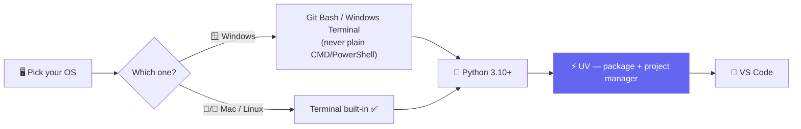
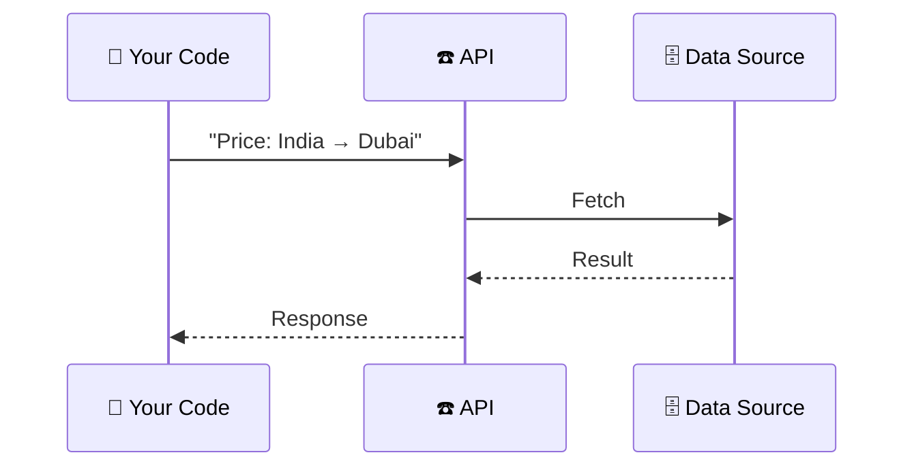

# 🐍 Class 01 — Python for AI: Dev Environment & Fundamentals
**📅 27 June 2026** · Agentic AI 3.0 Specialization · Mentor: Mayank Aggarwal

📖 **[Same write-up, indexed in classes_summary →](<../../classes_summary/01 - 27 Jun - Python Setup & API Basics.md>)**

---

## 💻 Setting Up the Dev Environment



**Why UV, not pip + venv + conda?** One fast tool replaces the juggling act. `uv init` scaffolds a project with its own `pyproject.toml` — the exact Python version and dependency list any teammate's machine can reproduce, the same role `package.json` plays in Node. The real starter project shipped this class, [`my-first-project/`](<my-first-project/>), is exactly that scaffold — `pyproject.toml`, `uv.lock`, `.python-version`, and a `main.py` doing nothing more than proving the wiring works:

```python
def main():
    print("Hello from my-first-project!")

if __name__ == "__main__":
    main()
```

**Why VS Code, not Jupyter?** This is an *Agentic AI* course, not classic Data Science — the workflow leans on `.py` scripts, a real terminal (you'll SSH into cloud machines constantly later), and proper debugging.

## 🐍 Python Fundamentals — Framed as Agent Vocabulary From Day One

The real teaching file, [`Python_foundamentals.py`](<Python_foundamentals.py>), doesn't teach variables and types as an abstract exercise — every line is captioned with the exact agent concept it becomes later:

```python
city = "Tokyo"                    # str   -- this is what a tool ARGUMENT looks like
temperature = 22.5                # float -- this is what a tool RESULT often looks like
is_raining = False                # bool  -- this is what a DECISION inside an agent looks like
forecast = [22.5, 23.1, 21.8]     # list  -- a sequence of readings, in order

print(f"The temperature in {city} is {temperature} degrees.")
print(f"That's {temperature * 9 / 5 + 32:.1f}°F.")   # math works inside f-string { } too

if is_raining:
    print("Bring an umbrella.")
else:
    print("No umbrella needed.")

for day_temp in forecast:
    if day_temp > 23:
        print(f"{day_temp}°C — warm day")
```

The file's own closing line makes the intent explicit:
> *"Every one of these types and decisions reappears, unchanged, inside the agent you build later."*

## 🌐 APIs, Before Any Framework

> *"If I hand you an old keypad phone with no internet and ask for a flight price, you call a travel agent — they fetch it and call you back. That's an API call."*



The live demo, [`currency.py`](<currency.py>), builds exactly this against a real, free, key-free currency API:

```python
import requests

BASE = "https://api.frankfurter.app"
url = f"{BASE}/latest"
params = {"from": "USD", "to": "INR", "amount": 100}

try:
    response = requests.get(url, params=params, timeout=10)   # timeout = hang up if no answer in 10s
    response.raise_for_status()
    data = response.json()
    converted_amount = data["rates"]["INR"]
    print(f"100 USD = {converted_amount:.2f} INR")
except requests.exceptions.RequestException as e:
    print("Request failed:", e)
```

This is the same shape every LLM call (OpenAI, Anthropic, Groq...) will take for the rest of the course — send a request, get structured data back, handle the case where it fails.

## 🛠️ The First Hint of "Tools" — [`functions or tools.py`](<functions or tools.py>)

Two plain functions, written with nothing but a docstring and a return value — no framework, no decorator, no AI import in sight yet:

```python
import time

def get_current_time() -> str:
    """Return the current time as a human-readable string."""
    return time.strftime("%Y-%m-%d %H:%M:%S")

fake_weather_data = {
    "tokyo": "22°C, partly cloudy",
    "delhi": "34°C, clear skies",
    "london": "15°C, light rain",
}

def get_weather(city: str) -> str:
    """Return the current weather for `city`. (Mock data for teaching.)"""
    return fake_weather_data.get(city.lower(), f"No weather data for {city!r}")
```

[`tools.py`](<tools.py>) then takes this one step further, wrapping both functions in a hand-built `@tool` decorator that times every call and registers it in a `TOOL_REGISTRY` dict — a full year before "tool calling" is ever named, the shape is already sitting on screen:

```python
TOOL_REGISTRY: dict[str, Callable] = {}

def tool(func: Callable) -> Callable:
    @functools.wraps(func)
    def wrapper(*args, **kwargs):
        start = time.perf_counter()
        result = func(*args, **kwargs)
        elapsed_ms = (time.perf_counter() - start) * 1000
        print(f"[tool call] {func.__name__}({args}, {kwargs}) -> {result!r}  ({elapsed_ms:.2f} ms)")
        return result
    TOOL_REGISTRY[func.__name__] = wrapper
    return wrapper

@tool
def calculator(expression: str) -> float:
    """Safely evaluate a simple arithmetic expression, e.g. '12 * (4 + 1)'."""
    allowed_characters = set("0123456789+-*/(). ")
    if not set(expression) <= allowed_characters:
        raise ValueError(f"Expression contains characters that aren't allowed: {expression!r}")
    return eval(expression)  # safe here ONLY because of the character check above
```

The file's closing block deliberately feeds `calculator` a SQL-injection-shaped string (`"12 + ; DROP TABLE users;"`) to prove the guard clause catches it cleanly — the same defensive habit real tool-building will need once an LLM, not a human, decides what string to pass in.

## 🗣️ Why Frameworks Come Last

> *"Agent is a concept — you should never learn a concept through a framework first. I'll teach you to build agents in plain Python before we touch LangChain."*

This is the entire spine of the course's first phase: fundamentals in raw Python (Classes 01–06), *then* LangChain.

## 📂 All Files in This Folder

| File | What it is |
|---|---|
| [`Python_foundamentals.py`](<Python_foundamentals.py>) | Variables, types, f-strings, control flow, functions + docstrings |
| [`OOPS.py`](<OOPS.py>) | First object-oriented Python outline |
| [`currency.py`](<currency.py>) | Live currency-exchange API call with `requests` |
| [`functions or tools.py`](<functions or tools.py>), [`tools.py`](<tools.py>) | Function design previewing agent "tools", then a hand-built `@tool` registry |
| [`notebook.ipynb`](<notebook.ipynb>) | Companion exploration notebook |
| [`my-first-project/`](<my-first-project/>) | A real `uv init` project — `pyproject.toml`, lockfile and all |

## ▶️ Run It

```bash
uv venv && source .venv/bin/activate   # Windows: .venv\Scripts\activate
uv add requests
uv run currency.py
```

## ✅ Action Items

- [ ] 🐍 Install Python 3.10+, UV, and VS Code
- [ ] 🪟 Windows: install Git Bash or Windows Terminal
- [ ] ⚡ Practice `uv venv` → activate → `uv add requests` → `deactivate`
- [ ] 🌐 Re-run `currency.py` and confirm the live rate against a web search
- [ ] 🛠️ Re-run `tools.py`, then deliberately break `calculator("2 + ; DROP TABLE")` and watch it get caught

---
⬆️ [Weekend 01 overview](<../README.md>) · ⬅️ [Course index](<../../README.md>) · ➡️ [Class 02-03](<../02-03 - 28 Jun & 4 Jul - Python Refresher & Pydantic Deep Dive/README.md>)
