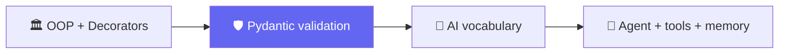

# 🧱 Class 02-03 — Python Refresher & Pydantic Deep Dive
**📅 28 June & 4 July 2026** · Agentic AI 3.0 Specialization · Mentor: Mayank Aggarwal



This folder is an expanded, self-contained codebase spanning OOP/decorators (Class 02) through Pydantic (Class 03) and previewing the tool-and-memory agent pattern that Classes 04-05 build in full.

---

# 🧱 Class 02 — Python Refresher: OOP, Decorators & the Case for Pydantic
**📅 28 June 2026**

## 🏛️ Object-Oriented Python — The Bank Account Example

The real file, [`_2_oop_classes.py`](<_2_oop_classes.py>), opens with a comment that sets up the entire class's arc: *"Class 1 only ever showed you a class wearing an 'Agent' costume; this file is the bare pattern, on its own, so it actually generalizes."*

```python
class BankAccount:
    """A blueprint for a bank account -- nothing to do with AI."""

    def __init__(self, owner: str, balance: float = 0.0):
        self.owner = owner       # every instance gets its OWN owner
        self.balance = balance   # and its OWN balance -- this is the account's STATE
        self.history = []

    def deposit(self, amount: float) -> None:
        self.balance += amount
        self.history.append(f"Deposited {amount}")

    def withdraw(self, amount: float) -> None:
        if amount > self.balance:
            print(f"Insufficient funds: tried to withdraw {amount}, balance is {self.balance}")
            return
        self.balance -= amount
        self.history.append(f"Withdrew {amount}")
```

The `if amount > self.balance` guard is a small, deliberate preview of the safety checks agents will need later.

## 📦 DataClasses — Killing the Boilerplate

```python
from dataclasses import dataclass, field

@dataclass
class Book:
    title: str
    author: str
    pages_read: int = 0
    tags: list = field(default_factory=list)   # mutable defaults need field(default_factory=...)

    def read(self, pages: int) -> None:
        self.pages_read += pages
```

`@dataclass` auto-generates `__init__` from type-hinted attributes — but it **does not validate anything at runtime**. That gap is exactly what this class's Pydantic deep-dive closes. The file's closing line even flags this forward: *"Hold onto this exact pattern: file 11 today reuses it, unchanged, to define an Agent."*

## 🎁 Decorators — Wrapping Without Changing

[`_4_decorators.py`](<_4_decorators.py>) builds two decorators, then stacks them:

```python
import functools, time

def announce(func):
    @functools.wraps(func)   # preserves func.__name__ for introspection
    def wrapper(*args, **kwargs):
        print(f"Starting {func.__name__}...")
        result = func(*args, **kwargs)
        print(f"Finished {func.__name__}.")
        return result
    return wrapper

def timed(func):
    @functools.wraps(func)
    def wrapper(*args, **kwargs):
        start = time.perf_counter()
        result = func(*args, **kwargs)
        elapsed_ms = (time.perf_counter() - start) * 1000
        print(f"{func.__name__} took {elapsed_ms:.2f} ms")
        return result
    return wrapper

@announce
@timed
def slow_greeting(name):
    time.sleep(0.02)
    return f"Hello there, {name}!"
```

🔗 **Why this matters later:** agent tool definitions (`@tool`) use exactly this pattern. File `_10` later in this same folder reuses this exact wrapper, unchanged, to register a real tool.

📖 **[Full Class 02 write-up in classes_summary →](<../../classes_summary/02 - 28 Jun - Python Refresher.md>)**

---

# 🛡️ Class 03 — Pydantic Deep Dive + AI Foundations
**📅 4 July 2026**

## 😩 The Problem, Stated in Code First

[`_8_pydantic_with_ai.py`](<_8_pydantic_with_ai.py>) opens with the actual failure mode Pydantic exists to catch — a realistic messy LLM reply: `{"amount": "five hundred", "currency": "us dollars"}` — *"'five hundred' isn't a number Python can do math with. 'us dollars' isn't a currency CODE."*

```python
from pydantic import BaseModel, Field, field_validator, ValidationError

class CurrencyAmount(BaseModel):
    amount: float
    currency: str

good = CurrencyAmount(amount=100, currency="USD")             # ✅ fine
try:
    CurrencyAmount(amount="five hundred", currency="USD")     # ❌ ValidationError, instantly
except ValidationError as exc:
    print(exc)
coerced = CurrencyAmount(amount="100", currency="USD")        # "100" (str) -> 100.0 (float), automatically
```

**`Field()` constraints beyond type:**
```python
class BoundedAmount(BaseModel):
    amount: float = Field(gt=0, description="Must be positive")
    currency: str = Field(min_length=3, max_length=3)
```

**Custom rules with `@field_validator` — the same decorator pattern from Class 02:**
```python
KNOWN_CURRENCIES = {"USD", "INR", "EUR", "GBP", "JPY"}

class StrictAmount(BaseModel):
    amount: float = Field(gt=0)
    currency: str

    @field_validator("currency")
    @classmethod
    def must_be_known(cls, value: str) -> str:
        value = value.upper().strip()
        if value not in KNOWN_CURRENCIES:
            raise ValueError(f"{value!r} isn't a recognized currency: {KNOWN_CURRENCIES}")
        return value
```

**The use case that actually matters — validating an LLM's raw text:**
```python
llm_messy_output = '{"amount": "a few hundred", "currency": "dollars"}'
try:
    StrictAmount.model_validate_json(llm_messy_output)
except ValidationError as exc:
    print(f"Caught before it could break anything downstream:\n{exc}")
```

## 🧠 AI Vocabulary — Five Terms Before Building an Agent

| Term | One-line mental model |
|---|---|
| **LLM** | Predicts the next *token*, not the next word |
| **Tokens** | The billing currency — output costs more than input |
| **Vector Embeddings** | Similar meaning → close together in vector space |
| **Context Window** | A whiteboard of fixed size — oldest content erased once full |
| **Parameters** | Billions of fixed weights set at training time — not the same as tokens |

📖 **[Full Class 03 write-up in classes_summary →](<../../classes_summary/03 - 4 Jul - Pydantic Deep Dive.md>)**

---

## 📂 All 15 Files + the Standalone Pydantic Mini-Project

Also included in this folder: a standalone [`8_Pydantic/`](<8_Pydantic/>) mini-project (`BaseModel`, `EmailStr`, typed lists/dicts, built up from scratch).

## Class 2 — Pydantic — Expanded Starter Codebase
**15 standalone files, basics through a memory-holding, multi-tool agent.**
**Real currency API (free). Real LLM via Groq and/or OpenRouter (free). OpenAI shown, not required.**

Agentic AI 3.0 · Phase 0 · Class 2 of 4

## Files, in teaching order

| File | Covers | Agent/AI mentioned? |
|---|---|---|
| `_0_basics_refresher.py` | Quick Class 1 recap | No |
| `_1_data_structures.py` | Lists, dicts, tuples, list-of-dicts | No |
| `_2_oop_classes.py` | Classes — BankAccount, Book (no Agent) | No |
| `_3_error_handling.py` | try/except, multiple patterns | No |
| `_4_decorators.py` | The wrapper pattern, generic | No |
| `_5_calling_a_real_api.py` | `requests`, real currency conversion | First real API, no AI |
| `_6_fake_ai_call.py` | The OpenAI-style shape, zero dependency | First AI mention |
| `_7_ai_call_free_and_paid.py` | Groq, OpenRouter (free), OpenAI (paid, shown not required) | Yes |
| `_8_pydantic_with_ai.py` | **Main topic.** BaseModel, Field, validators, nested models, validating LLM output | Yes |
| `_9_api_call_with_structure.py` | File 5's API call, now Pydantic-validated | No new AI, just structure |
| `_10_tool_with_ai_call.py` | Validated tool + AI call, side by side, decorator applied for real | Yes |
| `_11_agent_class_ai_only.py` | Agent via OOP (File 2's pattern), brain only | Yes |
| `_12_agent_with_one_tool.py` | Same agent, + the currency tool | Yes |
| `_13_agent_with_more_tools.py` | + weather, + calculator (3 tools total) | Yes |
| `_14_agent_with_memory.py` | Memory named explicitly + everything combined | Yes |

Numbering uses a leading underscore (`_0_`, `_1_`...) — same reason as before: Python can't `import` a file starting with a bare digit, but a leading underscore sorts and reads the same way while staying importable.

**Every file is self-contained and runnable on its own** — none of them require running the others first, even though later files reuse earlier patterns by re-declaring them (not importing across the whole chain), so you can hand any single file to a student without the rest.

## Setup

You already have `uv` from Class 1.
```bash
uv add requests pydantic python-dotenv
```
Optional, for real AI calls (every file falls back automatically without this):
```bash
uv add openai
cp .env.example .env   # paste a free Groq and/or OpenRouter key in
```

## Run things in this order

```bash
uv run _0_basics_refresher.py
uv run _1_data_structures.py
uv run _2_oop_classes.py
uv run _3_error_handling.py
uv run _4_decorators.py
uv run _5_calling_a_real_api.py
uv run _6_fake_ai_call.py
uv run _7_ai_call_free_and_paid.py
uv run _8_pydantic_with_ai.py
uv run _9_api_call_with_structure.py
uv run _10_tool_with_ai_call.py
uv run _11_agent_class_ai_only.py
uv run _12_agent_with_one_tool.py
uv run _13_agent_with_more_tools.py
uv run _14_agent_with_memory.py
```

## A note on testing

Files `_5`, `_7`, `_9`, `_10`, `_12`, `_13`, `_14` make real network calls (Frankfurter and/or Groq/OpenRouter). Every line of request-building, response-parsing, and Pydantic validation was tested — including every failure path (bad input, missing key, network timeout) — using mocked responses that match each provider's exact documented response shape. The live calls themselves need a real internet connection to complete; this build environment's network policy blocks those specific domains directly, so budget a few minutes before class to run each once for real.

## The one rule for this folder

If you can't point to which earlier file taught a pattern reused later, that pattern doesn't belong here yet.

---
⬆️ [Weekend 01 overview](<../README.md>) · ⬅️ [Class 01](<../01 - 27 Jun - Python Setup & API Basics/README.md>) · [Course index](<../../README.md>) · ➡️ [Class 04-05](<../../Weekend 02 - 4-5 Jul/04-05 - 5 Jul & 11 Jul - Anatomy of an Agent & The Agentic Loop/README.md>)
