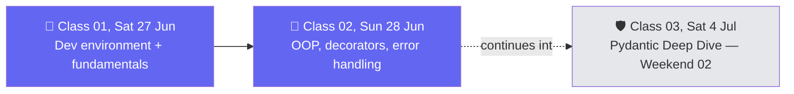

# 🗓️ Weekend 01 — 27-28 Jun — Python Setup & Refresher

**Agentic AI 3.0 Specialization · Live Class 2026 · Mentor: Mayank Aggarwal**

The first live weekend: from a blank terminal to writing code that already thinks like an agent will, months before an agent is ever built.

## 📖 This Weekend's Classes

| Class | Topic | Full write-up | Code |
|---|---|---|---|
| 01 | Python for AI: Dev Environment & Fundamentals | [classes_summary →](<../classes_summary/01 - 27 Jun - Python Setup & API Basics.md>) | [`01 - 27 Jun - Python Setup & API Basics/`](<01 - 27 Jun - Python Setup & API Basics/>) |
| 02 | Python Refresher: OOP, Decorators & the Case for Pydantic | [classes_summary →](<../classes_summary/02 - 28 Jun - Python Refresher.md>) | [`02-03 - 28 Jun & 4 Jul .../`](<02-03 - 28 Jun & 4 Jul - Python Refresher & Pydantic Deep Dive/>) (files `_0`–`_4`) |

Class 01 gets the dev environment sorted — UV, VS Code, `.env` hygiene — then teaches Python fundamentals with every variable and function captioned as the agent concept it becomes later. Class 02 picks the pace up into real OOP, decorators, and error handling, laying the groundwork for why Pydantic (Class 03, next weekend) becomes necessary the moment you can't trust a plain `dict`.

> ℹ️ **Shared code folder:** `02-03 - 28 Jun & 4 Jul - Python Refresher & Pydantic Deep Dive/` holds both Class 02 (this weekend) and Class 03 (Weekend 02, 4 Jul) — the two sessions build one continuous codebase, so the folder lives here where it started. [Weekend 02](<../Weekend 02 - 4-5 Jul/README.md>) links back to it for Class 03.

## 🔁 Weekend Navigation

⬅️ [Weekend 00 — Induction](<../Weekend 00 - 20-21 Jun/README.md>) · ⬆️ [Course index](<../README.md>) · ➡️ [Weekend 02 — 4-5 Jul](<../Weekend 02 - 4-5 Jul/README.md>)
