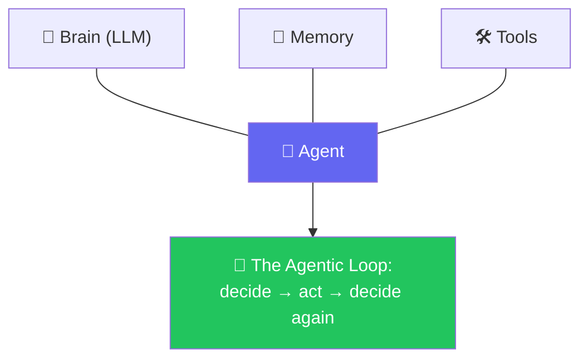

# 🤖 Class 04-05 — Anatomy of an Agent & The Agentic Loop
**📅 5 July & 11 July 2026** · Agentic AI 3.0 Specialization · Mentor: Mayank Aggarwal



Two weekends building a real agent in **pure Python, no framework**, inside [`Project 0/`](<Project 0/>) — the Brain → Memory → Tools anatomy (Class 04), then the full agentic loop with a terminal chat and a Streamlit front end (Class 05).

---

# 🤖 Class 04 — LLMs Are Stateless & The Anatomy of an Agent
**📅 5 July 2026**

## 🪜 Model → Chatbot → Agent, in Actual Code

[`Project 0/_01_ai_model_vs_chatbot_vs_agent.py`](<Project 0/_01_ai_model_vs_chatbot_vs_agent.py>) draws all three as real Python, deliberately with **no API calls yet**:

```python
def ai_model(question: str) -> str:
    """A single one-shot prediction. Remembers NOTHING between calls."""
    return f"[Mock prediction for]: {question}"

class Agent:
    """Wraps ai_model() with history AND a set of tools it can choose to use."""
    def __init__(self, tools: dict[str, callable]) -> None:
        self.history: list[dict] = []
        self.tools = tools

    def decide_tool(self, question: str) -> str | None:
        for name in self.tools:
            if name in question.lower():   # a KEYWORD match -- deliberately naive for now
                return name
        return None
```

The file is explicit that `decide_tool`'s keyword match is a placeholder: *"NOT how real decision-making works — File 5 replaces this with a real model actually making that choice based on meaning, not string matching."*

## 🔌 Calling a Real Model — Four Providers, One Shape

[`Project 0/_02_calling_the_ai_paid_and_free.py`](<Project 0/_02_calling_the_ai_paid_and_free.py>) puts all four side by side:

```python
def ask_anthropic(question: str) -> str:
    """Paid. Anthropic's SDK is the ONE exception among these four: .messages.create()
    instead of .chat.completions.create(), and .content[0].text instead of
    .choices[0].message.content."""
    from anthropic import Anthropic
    client = Anthropic(api_key=os.environ["ANTHROPIC_API_KEY"])
    response = client.messages.create(model="claude-3-5-haiku-20241022", max_tokens=200,
                                        messages=[{"role": "user", "content": question}])
    return response.content[0].text
```

## 📐 Structuring the Reply, Then 🛠️ Giving It a Tool — Manually

[`Project 0/_03_structuring_with_pydantic.py`](<Project 0/_03_structuring_with_pydantic.py>) validates a `WeatherQuestion` extracted from free text; [`Project 0/_04_giving_it_a_tool.py`](<Project 0/_04_giving_it_a_tool.py>) chains that straight into a real tool call — but **we** decide to call it, not the model:

```python
def answer_weather_question(user_message: str) -> str:
    """WE decide to call get_weather and WE pass the extracted field in.
    Nothing here is decided by the model beyond the extraction step."""
    extracted = extract_weather_question(user_message)
    if not isinstance(extracted, WeatherQuestion):
        return f"Could not extract a city: {extracted}"
    return get_weather(extracted.city)
```

That's the exact gap Class 05 closes.

📖 **[Full Class 04 write-up in classes_summary →](<../../classes_summary/04 - 5 Jul - Anatomy of an Agent.md>)**

---

# 🔁 Class 05 — Building Real Agents in Pure Python: The Agentic Loop
**📅 11 July 2026**

## 🧠 Letting the Model Choose — a Real Multi-Tool-Call Transcript

[`Project 0/_05_teaching_it_to_choose.py`](<Project 0/_05_teaching_it_to_choose.py>) keeps its own real class transcript in a comment — a single question that triggered **three tool calls at once**:

```text
What is the capital of Japan?
Model's raw reply: ...tool_calls=[
    Function(arguments='{"country":"Japan"}', name='get_capital'),
    Function(arguments='{"country":"Tokyo"}', name='get_capital'),
    Function(arguments='{"country":"Delhi"}', name='get_capital')]
```

## 🔁 The Agentic Loop, Assembled

[`Project 0/_06_project_zero_agent.py`](<Project 0/_06_project_zero_agent.py>) is where every previous file's pattern locks together:

```python
def run_agent(messages: list, max_turns: int = 4) -> str:
    client, model = get_client_and_model()
    for _ in range(max_turns):
        response = client.chat.completions.create(model=model, max_tokens=300, messages=messages, tools=TOOL_SCHEMAS)
        message = response.choices[0].message
        if not message.tool_calls:
            messages.append({"role": "assistant", "content": message.content})
            return message.content
        messages.append({"role": "assistant", "content": message.content, "tool_calls": [...]})
        for call in message.tool_calls:
            arguments = json.loads(call.function.arguments)
            result = TOOLS_BY_NAME[call.function.name](**arguments)
            messages.append({"role": "tool", "tool_call_id": call.id, "content": str(result)})
    return "Reached max_turns without a final answer."
```

## 🎨 The Streamlit Front End — Three Real Tools

[`Project 0/_07_streamlit_app.py`](<Project 0/_07_streamlit_app.py>) drives a real chat UI with weather (mock), a sandboxed `calculator`, and **live** currency conversion:

```python
if "messages" not in st.session_state:
    st.session_state.messages = []   # this app's memory -- survives Streamlit's re-runs

user_input = st.chat_input("Ask about the weather, do some maths, or convert a currency...")
if user_input:
    st.session_state.messages.append({"role": "user", "content": user_input})
    with st.chat_message("assistant"):
        answer = run_agent(st.session_state.messages)
        st.write(answer)
```

📖 **[Full Class 05 write-up in classes_summary →](<../../classes_summary/05 - 11 Jul - The Agentic Loop.md>)**

---

## 📂 Files — [`Project 0/`](<Project 0/>)

| File | Class | Covers |
|---|---|---|
| [`_01_ai_model_vs_chatbot_vs_agent.py`](<Project 0/_01_ai_model_vs_chatbot_vs_agent.py>) | 04 | Structural comparison, no API calls |
| [`_02_calling_the_ai_paid_and_free.py`](<Project 0/_02_calling_the_ai_paid_and_free.py>) | 04 | Real calls: OpenAI, Anthropic, Groq, OpenRouter |
| [`_03_structuring_with_pydantic.py`](<Project 0/_03_structuring_with_pydantic.py>) | 04 | Structured JSON extraction, validated |
| [`_04_giving_it_a_tool.py`](<Project 0/_04_giving_it_a_tool.py>) | 04 | A weather tool, called manually |
| [`_05_teaching_it_to_choose.py`](<Project 0/_05_teaching_it_to_choose.py>) | 05 | Tool schema + the model choosing the tool itself |
| [`_06_project_zero_agent.py`](<Project 0/_06_project_zero_agent.py>) | 05 | Full loop, terminal chat, one tool |
| [`_07_streamlit_app.py`](<Project 0/_07_streamlit_app.py>) | 05 | Full loop + Streamlit UI, three tools |

See [`Project 0/README.md`](<Project 0/README.md>) for setup and run instructions.

---
⬆️ [Weekend 02 overview](<../README.md>) · ⬅️ [Class 02-03](<../../Weekend 01 - 27-28 Jun/02-03 - 28 Jun & 4 Jul - Python Refresher & Pydantic Deep Dive/README.md>) · [Course index](<../../README.md>) · ➡️ [Class 06](<../../Weekend 03 - 11-12 Jul/06 - 12 Jul - Introduction to LangChain/README.md>)
