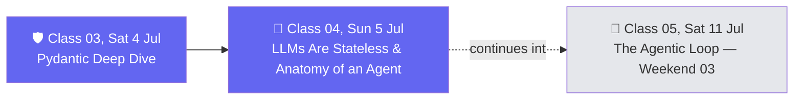

# 🗓️ Weekend 02 — 4-5 Jul — Pydantic & Anatomy of an Agent

**Agentic AI 3.0 Specialization · Live Class 2026 · Mentor: Mayank Aggarwal**

The weekend Pydantic stops being "that validation library" and starts being load-bearing — and where the word "agent" finally gets a precise, code-level definition.

## 📖 This Weekend's Classes

| Class | Topic | Full write-up | Code |
|---|---|---|---|
| 03 | Pydantic Deep Dive + AI Foundations | [classes_summary →](<../classes_summary/03 - 4 Jul - Pydantic Deep Dive.md>) | [`02-03 .../`](<../Weekend 01 - 27-28 Jun/02-03 - 28 Jun & 4 Jul - Python Refresher & Pydantic Deep Dive/>) (files `_5`–`_10`, [`8_Pydantic/`](<../Weekend 01 - 27-28 Jun/02-03 - 28 Jun & 4 Jul - Python Refresher & Pydantic Deep Dive/8_Pydantic/>)) — lives in [Weekend 01](<../Weekend 01 - 27-28 Jun/README.md>) |
| 04 | LLMs Are Stateless & The Anatomy of an Agent | [classes_summary →](<../classes_summary/04 - 5 Jul - Anatomy of an Agent.md>) | [`04-05 .../Project 0/`](<04-05 - 5 Jul & 11 Jul - Anatomy of an Agent & The Agentic Loop/Project 0/>) (files `_01`–`_04`) |

Class 03 builds `BaseModel`, `Field()` constraints, and validators from an empty file — the exact tool needed the moment an LLM's raw text output must become structured, trustworthy data. Class 04 immediately puts that to work: it names the core insight that an LLM call is *stateless* (no memory between calls unless you build it), then lays out the anatomy of an agent — model + tools + memory + loop — that **Project Zero** is built around for the rest of this arc.

> ℹ️ **Shared code folders:** Class 03's code lives in `02-03 .../` inside **[Weekend 01](<../Weekend 01 - 27-28 Jun/README.md>)** (continuous with Class 02). Class 05's code (next weekend, 11 Jul) continues in this weekend's own `04-05 .../Project 0/` folder — see below.

## 🔁 Weekend Navigation

⬅️ [Weekend 01 — 27-28 Jun](<../Weekend 01 - 27-28 Jun/README.md>) · ⬆️ [Course index](<../README.md>) · ➡️ [Weekend 03 — 11-12 Jul](<../Weekend 03 - 11-12 Jul/README.md>)
