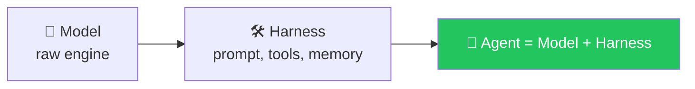

# 🔗 Class 06 — LangChain Begins: From Raw Python to `create_agent()`
**📅 12 July 2026** · Agentic AI 3.0 Specialization · Mentor: Mayank Aggarwal



> *"If ChatGPT told you 'go search Google yourself and paste the results back to me' — would that be useful? The whole point of an agent is that IT calls the tool, not you."*

This session opens by finishing the raw-Python agent from [Class 05](<../../Weekend 02 - 4-5 Jul/04-05 - 5 Jul & 11 Jul - Anatomy of an Agent & The Agentic Loop/>), then hands the exact same loop over to LangChain's `create_agent()` — the first framework of the course.

## ⚡ `create_agent()` — Real Code, Two Ways

[`langchain_agents.py`](<langchain_agents.py>) is the first working `create_agent()` call in the repo — a plain mock tool plus a genuinely useful one, a URL fetcher:

```python
from langchain.agents import create_agent
from langchain.tools import tool
import urllib.request, urllib.error

@tool
def fetch_text_from_url(url: str) -> str:
    """Fetch the document from a URL."""
    req = urllib.request.Request(url, headers={"User-Agent": "Mozilla/5.0 (compatible; quickstart-research/1.0)"})
    try:
        with urllib.request.urlopen(req, timeout=120) as resp:
            raw = resp.read()
    except urllib.error.URLError as e:
        return f"Fetch failed: {e}"
    return raw.decode("utf-8", errors="replace")

def get_weather(city: str) -> str:
    """Get weather for a given city."""
    return f"It's always sunny in {city}!"

agent = create_agent(model="openai:gpt-5.5", tools=[get_weather, fetch_text_from_url],
                      system_prompt="You are a helpful assistant")
result = agent.invoke({"messages": [{"role": "user", "content": "Who am I?"}]})
print(result["messages"][-1].content_blocks)
```

## 📖 A Real Research Agent — The Great Gatsby

[`langchain_basics.py`](<langchain_basics.py>) points `fetch_text_from_url` at a genuinely non-trivial task: a literary research agent that has to *ground* every claim in tool output, not guess:

```python
SYSTEM_PROMPT = """You are a literary data assistant.
## Capabilities
- `fetch_text_from_url`: loads document text from a URL into the conversation.
Do not guess line counts or positions—ground them in tool results from the saved file."""

model = init_chat_model("openai:gpt-5.5", temperature=0.5, timeout=300, max_tokens=25000)
agent = create_agent(model=model, tools=[fetch_text_from_url], system_prompt=SYSTEM_PROMPT, checkpointer=checkpointer)

content = """Project Gutenberg hosts a full plain-text copy of F. Scott Fitzgerald's The Great Gatsby.
URL: https://www.gutenberg.org/files/64317/64317-0.txt

Answer as much as you can:
1) How many lines in the complete Gutenberg file contain the substring `Gatsby`?
2) The 1-based line number of the first line in the file that contains `Daisy`.
3) A two-sentence neutral synopsis.

Do your best on (1) and (2). If at any point you realize you cannot **verify** an exact answer with
your available tools and reasoning, do not fabricate numbers: use `null` for that field and spell out
the limitation."""

agent_result = agent.invoke({"messages": [{"role": "user", "content": content}]},
                              config={"configurable": {"thread_id": "great-gatsby-lc"}})
```

This is doing real work worth noticing on two levels: it's a genuine test of tool-grounded accuracy (counting exact substring occurrences across a real ~280KB text file is not something a model should attempt from memory), and its system prompt explicitly forbids fabrication — a real, hands-on guardrail pattern, taught by example well before "guardrails" is named as a topic in Class 12.

The file also imports `from deepagents import create_deep_agent` at the top — a live preview of the third tier of the LangChain family (covered properly in Class 07), sitting right there unused, next to the `create_agent` import actually being taught this session.

## 📖 Documentation-Driven Building — The 5-Step Guide

LangChain's own quickstart: **1)** detailed system prompt → **2)** create tools (`@tool`) → **3)** configure the model (`init_chat_model`, temperature, timeout, max_tokens) → **4)** add memory → **5)** assemble and run the agent. Both real files above follow this shape exactly.

📖 **[Full class summary, diagrams & Q&A →](<../../classes_summary/06 - 12 Jul - Introduction to LangChain.md>)**

## 📂 Files in This Folder

| File | What it is |
|---|---|
| [`langchain_basics.py`](<langchain_basics.py>) | The Great Gatsby research agent — grounded, checkpointed, `deepagents` previewed |
| [`langchain_agents.py`](<langchain_agents.py>) | `get_weather` + `fetch_text_from_url`, the first working `create_agent()` |
| [`main.py`](<main.py>) | Project entry point |
| [`.env.example`](<.env.example>) | Provider key template — copy to `.env`, never commit the real one |

## ✅ Action Items

- [ ] 🏗️ `uv add langchain langchain-openai langchain-anthropic`
- [ ] 🔐 Practice `.env` + `.gitignore` + `.env.example` — never let a real key hit GitHub
- [ ] 📖 Run the Great Gatsby agent yourself, then manually verify its line-count answer against the real Gutenberg file
- [ ] ⚡ Print `result["messages"]` from `langchain_agents.py` and map each message back to Class 05's hand-built loop

---
⬆️ [Weekend 03 overview](<../README.md>) · ⬅️ [Class 04-05](<../../Weekend 02 - 4-5 Jul/04-05 - 5 Jul & 11 Jul - Anatomy of an Agent & The Agentic Loop/README.md>) · [Course index](<../../README.md>) · ➡️ [Class 07-08](<../../Weekend 04 - 18-19 Jul/07-08 - 18-19 Jul - LangChain Family & the Model Layer/README.md>)
