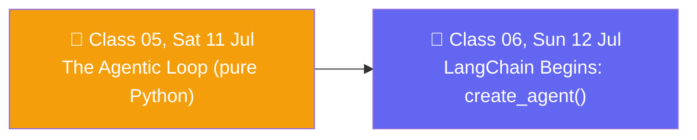

# 🗓️ Weekend 03 — 11-12 Jul — The Agentic Loop & LangChain Begins

**Agentic AI 3.0 Specialization · Live Class 2026 · Mentor: Mayank Aggarwal**

The hinge weekend of the course: Saturday finishes the hand-built agent in raw Python; Sunday hands that exact same loop over to a framework for the first time.

## 📖 This Weekend's Classes

| Class | Topic | Full write-up | Code |
|---|---|---|---|
| 05 | Building Real Agents in Pure Python: The Agentic Loop | [classes_summary →](<../classes_summary/05 - 11 Jul - The Agentic Loop.md>) | [`04-05 .../Project 0/`](<../Weekend 02 - 4-5 Jul/04-05 - 5 Jul & 11 Jul - Anatomy of an Agent & The Agentic Loop/Project 0/>) (files `_05`–`_07`) — lives in [Weekend 02](<../Weekend 02 - 4-5 Jul/README.md>) |
| 06 | LangChain Begins: From Raw Python to `create_agent()` | [classes_summary →](<../classes_summary/06 - 12 Jul - Introduction to LangChain.md>) | [`06 - 12 Jul - Introduction to LangChain/`](<06 - 12 Jul - Introduction to LangChain/>) |

Class 05 closes out **Project Zero** — the model learns to choose its own tool, the loop gets a terminal chat interface, then a Streamlit UI with three real tools (weather, calculator, currency). Class 06 immediately hands that same loop to LangChain's `create_agent()`: *"if ChatGPT told you 'go search Google yourself and paste the results back to me' — would that be useful? The whole point of an agent is that IT calls the tool, not you."*

> ℹ️ **Shared code folder:** Class 05's code lives in `04-05 .../Project 0/` inside **[Weekend 02](<../Weekend 02 - 4-5 Jul/README.md>)** (continuous with Class 04). Class 06 gets its own dedicated folder here.

## 🔁 Weekend Navigation

⬅️ [Weekend 02 — 4-5 Jul](<../Weekend 02 - 4-5 Jul/README.md>) · ⬆️ [Course index](<../README.md>) · ➡️ [Weekend 04 — 18-19 Jul](<../Weekend 04 - 18-19 Jul/README.md>)
