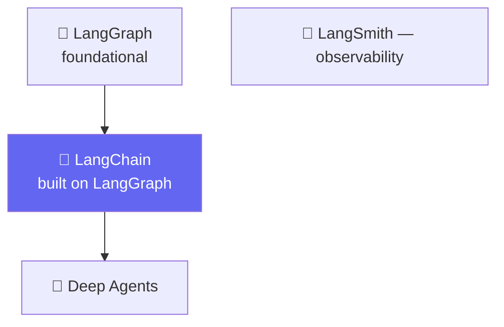

# 🚗 Class 07-08 — LangChain Family, Harness Engineering & the Model Layer
**📅 18-19 July 2026** · Agentic AI 3.0 Specialization · Mentor: Mayank Aggarwal



---

# 🚗 Class 07 — The LangChain Family, Harness Engineering & First Models
**📅 18 July 2026** · 📂 [`Notebook For Reference/01_landscape_student_notes.ipynb`](<Notebook For Reference/01_landscape_student_notes.ipynb>)

## 🏠 Four Products, One Team, Four Different Jobs

*"None of these four are competitors. You don't 'pick one.' You use as many as your project actually needs."*

- **LangGraph** — low-level orchestration foundation: branching, loops, persistence, durable execution.
- **LangChain** — `create_agent`, a highly configurable harness built *on top of* LangGraph. What the whole course is built around from here on.
- **Deep Agents** — built on top of `create_agent`; planning tools, virtual filesystem, sub-agent spawning, pre-wired.
- **LangSmith** — fundamentally different: an **observability and evaluation platform**, not something you build with.

## 🎯 The Single Most Important Sentence in This Course

> **An agent is a model calling tools in a loop until a given task is complete. A harness is everything around that loop.**

`create_agent(model=..., tools=..., system_prompt=...)` configures the harness *around* a model; it never builds a new model.

## 📜 A Real Timeline

| Date | What happened |
|---|---|
| Oct 2022 | LangChain launches — LLM abstractions + "Chains" |
| Dec 2022 | First general-purpose agents, based on ReAct |
| Feb 2024 | LangGraph released — durable execution, memory, HITL |
| Oct 2024 | LangGraph becomes preferred for anything past a single call |
| **Oct 20, 2025** | **LangChain v1.0** — one unified agent abstraction |
| Mar 15, 2026 | Deep Agents released |

**A concrete signal for outdated content:** a 2026-dated tutorial importing `AgentExecutor` directly from `langchain` throws an `ImportError` — that functionality now lives in the separate `langchain-classic` package.

## 💬 Real FAQs From This Exact Class

> **"If LangChain is 'built on top of' LangGraph, why don't we just learn LangGraph directly?"**
> Because `create_agent` is specifically designed to hide LangGraph's complexity until you actually need it — the same reason you don't learn assembly language before Python.

> **"Is LangSmith the same as print statements?"**
> Not remotely — a LangSmith trace shows the FULL sequence of every model call, tool call, and middleware decision, plus latency and token cost per step. The difference between a diary and a flight recorder.

📖 **[Full Class 07 write-up in classes_summary →](<../../classes_summary/07 - 18 Jul - LangChain Family & Harness Engineering.md>)**

---

# 🧠 Class 08 — Inside the Model: Environment, Messages, Streaming & Tool Binding
**📅 19 July 2026** · 📂 [`Notebook For Reference/02_03_environment_models_messages_student_notes.ipynb`](<Notebook For Reference/02_03_environment_models_messages_student_notes.ipynb>) · [`04_05_prompt_templates_structured_output_student_notes.ipynb`](<Notebook For Reference/04_05_prompt_templates_structured_output_student_notes.ipynb>)

## 🧬 What You Actually Get Back: the Full `AIMessage`

| Field | What it holds |
|---|---|
| `.text` / `.content` | The reply itself |
| `.content_blocks` | LangChain's standardized rich-content structure |
| `.tool_calls` | Any tool requests |
| `.usage_metadata` | Real, exact token counts |
| `.response_metadata` | Provider-specific extras |

```python
response = openai_model.invoke("Explain agentic AI in one sentence.")
print(response.usage_metadata)   # input_tokens, output_tokens, total_tokens -- the exact billed numbers
```

## 📡 Streaming: `AIMessageChunk` Objects That Sum With `+`

```python
chunks, full_message = [], None
for chunk in openai_model.stream("Write one short sentence about the ocean."):
    chunks.append(chunk)
    full_message = chunk if full_message is None else full_message + chunk
# full_message now comes out identical in shape to what .invoke() would have given
```

## 📝 Prompt Templates & 📐 Structured Output

```python
from langchain_core.prompts import ChatPromptTemplate

fun_fact_prompt = ChatPromptTemplate.from_messages([
    ("system", "You generate a single surprising fun fact. Tone: {tone}."),
    ("human", "Topic: {topic}"),
])
chain = fun_fact_prompt | openai_model   # | pipes the template's OUTPUT into the model's INPUT
```

```python
class SupportTicket(BaseModel):
    customer_name: str = Field(description="The customer's first name")
    issue_category: Literal["refund", "delivery", "product_defect", "other"]
    urgency: Literal["low", "medium", "high"]

structured_model = openai_model.with_structured_output(SupportTicket)
```

**`ProviderStrategy` vs. `ToolStrategy`:** the provider's own native feature (fast, only where supported) vs. a synthetic tool call that fakes it (works almost anywhere). Auto-selected unless forced.

📖 **[Full Class 08 write-up in classes_summary →](<../../classes_summary/08 - 19 Jul - Inside the Model.md>)**

---

## 📂 What's Here

| Path | Class | Covers |
|---|---|---|
| [`Langchain Practical/langchain-course/`](<Langchain Practical/langchain-course/>) | 07 | Real `uv`-based LangChain project |
| [`Notebook For Reference/01_landscape_student_notes.ipynb`](<Notebook For Reference/01_landscape_student_notes.ipynb>) | 07 | LangChain family + timeline |
| [`Notebook For Reference/02_03_environment_models_messages_student_notes.ipynb`](<Notebook For Reference/02_03_environment_models_messages_student_notes.ipynb>) | 07-08 | Environment, models, messages |
| [`Notebook For Reference/04_05_prompt_templates_structured_output_student_notes.ipynb`](<Notebook For Reference/04_05_prompt_templates_structured_output_student_notes.ipynb>) | 08 | Prompt templates, first structured output |
| [`Notebook For Reference/Revision_Parts_1-4.ipynb`](<Notebook For Reference/Revision_Parts_1-4.ipynb>) | 08 | Consolidated revision, shared before Class 09 |
| [`Notebook For Reference/Langchain_structured_output_tools_agents.ipynb`](<Notebook For Reference/Langchain_structured_output_tools_agents.ipynb>) | 08→09 | Bridges into the CineBot arc |

---
⬆️ [Weekend 04 overview](<../README.md>) · ⬅️ [Class 06](<../../Weekend 03 - 11-12 Jul/06 - 12 Jul - Introduction to LangChain/README.md>) · [Course index](<../../README.md>) · ➡️ [Class 09-10](<../../Weekend 05 - 25-26 Jul/09-10 - 25-26 Jul - Structured Output & Tools (CineBot)/README.md>)
