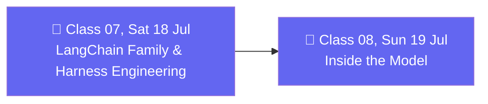

# 🗓️ Weekend 04 — 18-19 Jul — LangChain Family & the Model Layer

**Agentic AI 3.0 Specialization · Live Class 2026 · Mentor: Mayank Aggarwal**

Zooms out to place LangChain among LangGraph, deepagents and LangSmith, then zooms all the way into the model layer itself — messages, streaming, and structured output.

## 📖 This Weekend's Classes

| Class | Topic | Full write-up | Code |
|---|---|---|---|
| 07 | The LangChain Family, Harness Engineering & First Models | [classes_summary →](<../classes_summary/07 - 18 Jul - LangChain Family & Harness Engineering.md>) | [`07-08 .../`](<07-08 - 18-19 Jul - LangChain Family & the Model Layer/>) |
| 08 | Inside the Model: Environment, Messages, Streaming & Tool Binding | [classes_summary →](<../classes_summary/08 - 19 Jul - Inside the Model.md>) | ↑ same folder |

Class 07 answers "why not just learn LangGraph directly?" — `create_agent` hides LangGraph's complexity until you actually need it, the same reason nobody learns assembly before Python — and gets a real `uv`-based LangChain project running in VS Code. Class 08 goes underneath the agent abstraction entirely: `init_chat_model`, message types, `ProviderStrategy` vs. `ToolStrategy` for structured output, streaming, and tool binding.

## 🔁 Weekend Navigation

⬅️ [Weekend 03 — 11-12 Jul](<../Weekend 03 - 11-12 Jul/README.md>) · ⬆️ [Course index](<../README.md>) · ➡️ [Weekend 05 — 25-26 Jul](<../Weekend 05 - 25-26 Jul/README.md>)
