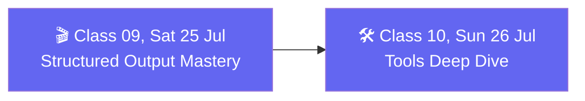

# 🗓️ Weekend 05 — 25-26 Jul — Structured Output & Tools (CineBot)

**Agentic AI 3.0 Specialization · Live Class 2026 · Mentor: Mayank Aggarwal**

CineBot, the movie-ticket booking agent, becomes the vehicle for the whole weekend — first it learns to answer in guaranteed shapes, then it learns to act.

## 📖 This Weekend's Classes

| Class | Topic | Full write-up | Code |
|---|---|---|---|
| 09 | Structured Output Mastery: Building CineBot | [classes_summary →](<../classes_summary/09 - 25 Jul - Structured Output Mastery.md>) | [`09-10 .../`](<09-10 - 25-26 Jul - Structured Output & Tools (CineBot)/>) |
| 10 | Tools Deep Dive: Giving CineBot Hands | [classes_summary →](<../classes_summary/10 - 26 Jul - Tools Deep Dive.md>) | ↑ same folder |

Class 09 forces every CineBot reply through Pydantic schemas — `model.profile`, `Union` types for multi-intent messages, and graceful recovery when the model's answer doesn't fit. Class 10 gives it hands: `@tool`, `args_schema`, `ToolRuntime`, and memory-backed tools, wired into a TripMate agent with real weather (Open-Meteo), real search (Tavily), and real SQLite persistence — not mocks.

## 🔁 Weekend Navigation

⬅️ [Weekend 04 — 18-19 Jul](<../Weekend 04 - 18-19 Jul/README.md>) · ⬆️ [Course index](<../README.md>) · ➡️ [Weekend 06 — 1 Aug](<../Weekend 06 - 1 Aug/README.md>)
