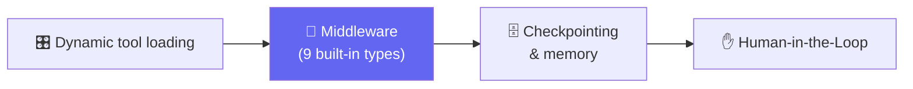

# 🧵 Class 11-12 — Agents, Memory & Middleware Mastery
**📅 1 & 8-9 August 2026** · Agentic AI 3.0 Specialization · Mentor: Mayank Aggarwal



The most architectural pair of sessions in the course: giving CineBot a mind. Real code below is pulled directly from [`MIddleware.ipynb`](<MIddleware.ipynb>) and the real whiteboard, [`Agent-Middleware-Architecture.excalidraw`](<Agent-Middleware-Architecture.excalidraw>) (open it at [excalidraw.com](https://excalidraw.com)).

---

# 🤖 Class 11 — Agents, Middleware & Memory
**📅 1 August 2026**

## The Loop, Straight From the Real Whiteboard

The board captions the whole idea in one line: *"Middleware provides us a way to more tightly control what happens inside the agent."*


## ✋ Human-in-the-Loop — the Real Interrupt Diagram

```text
User → LLM → your_send_email_tool → requires approval → INTERRUPT
  ├── approve → send email
  ├── edit    → modify tool arguments
  └── reject  → don't send
```

```python
guarded_agent = create_agent(
    model="openai:gpt-5-mini", tools=cinebot_tools,
    middleware=[HumanInTheLoopMiddleware(
        interrupt_on={"cancel_booking": {"allowed_decisions": ["approve", "edit", "reject", "respond"]}})],
    checkpointer=InMemorySaver(),  # REQUIRED -- HITL needs to pause and later resume
)
resumed_result = guarded_agent.invoke(Command(resume={"decisions": [{"type": "approve"}]}), config=config)
```

The whiteboard frames this with a real analogy — **Request ---> Brain ----> Tool**, with a human standing at that last arrow, captioned simply **"Intern."** An intern with a great brain still needs sign-off before doing something irreversible.

## 📝 Summarization Middleware

```python
SummarizationMiddleware(model="gpt-5.4-mini", trigger=("token", 4000), keep=("messages", 10))
```
Real doc note: *"Summarization is text-oriented context compression. It does not resize, downsample, or otherwise compress image/audio/video payloads."* Whiteboard's own numbers: **4k tokens** triggers → **100k ----> 10k tokens**.

## 🗄️ Memory — the Whiteboard's Own Before/After

Labeled directly on the drawing: **"without in memory saver"** → *"Empty & Nothing Remembered"* vs. **"with in memory saver"** → *"it has all the Previous messages."*

📖 **[Full Class 11 write-up in classes_summary →](<../../classes_summary/11 - 01 Aug - Agents, Middleware & Memory.md>)**

---

# 🧵 Class 12 — Mastering Middleware
**📅 8–9 August 2026** (the notebook's own cells mark a real "9th August" continuation)

Nine built-in middlewares, all run against the same `cinebot_tools`:

| Middleware | Real config from class |
|---|---|
| **Model Call Limit** | `ModelCallLimitMiddleware(thread_limit=5, run_limit=2, exit_behavior="end")` — whiteboard analogy: *Chappatis per meal (run) vs. total across all meals (thread)* |
| **Model Fallback** | `ModelFallbackMiddleware("openai:gpt-5-mini")` — whiteboard: *"AI -> I am unable to connect"* is the failure this prevents |
| **Tool Call Limit** | `ToolCallLimitMiddleware(tool_name="cancel_booking", thread_limit=2, run_limit=1)` |
| **PII Detection** | `PIIMiddleware("email", strategy="redact")` + a **custom regex detector** for CineBot's own `BK\d{4}` booking codes; whiteboard names **Aadhaar** and **PAN** as the India-specific IDs no built-in detector covers |
| **Todo List** | `TodoListMiddleware()` — explicit trackable plan for multi-step requests |
| **LLM Tool Selector** | `LLMToolSelectorMiddleware(max_tools=2, always_include=["check_showtimes"])` — a cheaper model pre-filters which tools even get sent |
| **Tool Error** | `ToolErrorMiddleware(on_error=on_seat_error)` — returns the exception *type*, never internal `str(exc)` text, to the model |
| **Tool Retry** | `ToolRetryMiddleware(max_retries=3, backoff_factor=2.0, initial_delay=1.0)` — real formula: `delay = initial_delay * backoff_factor ** retry_number` (1s, 2s, 4s) |
| **LLM Tool Emulator** | `LLMToolEmulator(tools=["book_seats", "cancel_booking"])` — fakes specific tools via a second model call, for safe testing |

## 🔁 Tool Retry — the Real Exponential Backoff

```python
@tool
def flaky_showtime_check(movie_title: str) -> str:
    """Check showtimes via an external service that can transiently fail."""
    if not random.random() > 1:
        raise ConnectionError("Simulated network failure -- exactly what a real external call risks.")
    return f"{movie_title}: showing at 8:00 PM."

resilient_tool_agent = create_agent(
    model="openai:gpt-5-mini", tools=[flaky_showtime_check],
    middleware=[ToolRetryMiddleware(max_retries=3, backoff_factor=2.0, initial_delay=1.0, on_failure="continue")],
)
```

## 🕵️ PII — Custom Detector for CineBot's Own Booking Codes

```python
def detect_booking_code(content: str) -> list[dict]:
    """Detect CineBot's own booking code format: BK followed by 4 digits."""
    return [{"text": m.group(0), "start": m.start(), "end": m.end()} for m in re.finditer(r"BK\d{4}", content)]

custom_pii_agent = create_agent(model="openai:gpt-5-mini", tools=cinebot_tools,
    middleware=[PIIMiddleware("booking_code", detector=detect_booking_code, strategy="mask")])
```

## 🌍 Real-World Mapping (straight from the notebook)

> **Fraud detection in fintech** — a `wrap_tool_call` hook around every transaction-executing tool. **Healthcare** — `PIIMiddleware` redaction as a HIPAA legal requirement. **Customer support** — HITL approval gates before refunds/account changes. **Internal tools** — audit logging via `wrap_tool_call`, close to universal wherever "who did what, when" needs a real answer.

📖 **[Full Class 12 write-up, with every middleware's complete code →](<../../classes_summary/12 - 08 Aug - Mastering Middleware.md>)**

---

## 📂 What's Here

| File | Class | Covers |
|---|---|---|
| [`Agent-Middleware-Architecture.excalidraw`](<Agent-Middleware-Architecture.excalidraw>) | 11-12 | The real whiteboard — 93 real text labels, drawn live |
| [`Agent-Middleware-Architecture.pdf`](<Agent-Middleware-Architecture.pdf>) | 11-12 | Exported, viewable version of the same diagram |
| [`MIddleware.ipynb`](<MIddleware.ipynb>) | 11-12 | All nine built-in middlewares, worked live, 146 real cells |
| [`Middleware-Architecture-Sketch.ipynb`](<Middleware-Architecture-Sketch.ipynb>) | 12 | Early loop-diagram sketch |
| [`Assignment & Questions/Assignment_2_Agents_and_Prebuilt_Middleware.ipynb`](<Assignment & Questions/Assignment_2_Agents_and_Prebuilt_Middleware.ipynb>) | 11-12 | Assignment 2 — Agents & Prebuilt Middleware |

🔗 Live Colab used in class: [Middleware notebook](https://colab.research.google.com/drive/1Qt9uU2HhDvtFTWwbbFBYxK86jJypv1w_?usp=sharing)

---
⬆️ [Weekend 06 overview](<../README.md>) · ⬅️ [Class 09-10](<../../Weekend 05 - 25-26 Jul/09-10 - 25-26 Jul - Structured Output & Tools (CineBot)/README.md>) · [Course index](<../../README.md>) · ➡️ [Weekend 07 (Class 12 continues here)](<../../Weekend 07 - 8-9 Aug/README.md>)
