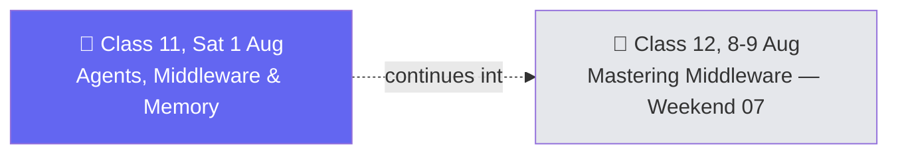

# 🗓️ Weekend 06 — 1 Aug — Agents, Memory & Middleware (Part 1)

**Agentic AI 3.0 Specialization · Live Class 2026 · Mentor: Mayank Aggarwal**

A single-day weekend (no Sunday session this week) that gives CineBot a mind: real memory, and the first layer of middleware sitting between the agent and the model.

## 📖 This Weekend's Class

| Class | Topic | Full write-up | Code |
|---|---|---|---|
| 11 | Agents, Middleware & Memory: Giving CineBot a Mind | [classes_summary →](<../classes_summary/11 - 01 Aug - Agents, Middleware & Memory.md>) | [`11-12 .../`](<11-12 - 1-8 Aug - Agents, Memory & Middleware/>) (`MIddleware.ipynb` cells 0–56) |

The real whiteboard drawn live this class — 93 labeled elements, [`Agent-Middleware-Architecture.excalidraw`](<11-12 - 1-8 Aug - Agents, Memory & Middleware/Agent-Middleware-Architecture.excalidraw>) — lays out the before/after of adding an in-memory saver ("Empty & Nothing Remembered" vs. "it has all the Previous messages") and introduces summarization as context compression: **4k tokens** triggers a squeeze from **100k → 10k tokens**.

> ℹ️ **Shared code folder:** `11-12 - 1-8 Aug - Agents, Memory & Middleware/` holds both Class 11 (this weekend) and Class 12 (Weekend 07, 8–9 Aug) — one continuous notebook. It lives here where it started; [Weekend 07](<../Weekend 07 - 8-9 Aug/README.md>) links back to it for Class 12.

## 🔁 Weekend Navigation

⬅️ [Weekend 05 — 25-26 Jul](<../Weekend 05 - 25-26 Jul/README.md>) · ⬆️ [Course index](<../README.md>) · ➡️ [Weekend 07 — 8-9 Aug](<../Weekend 07 - 8-9 Aug/README.md>)
