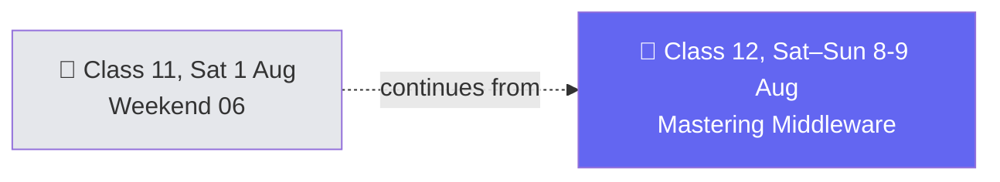

# 🗓️ Weekend 07 — 8-9 Aug — Mastering Middleware

**Agentic AI 3.0 Specialization · Live Class 2026 · Mentor: Mayank Aggarwal**

The middleware notebook started last weekend continues straight through — the session's own cells mark a real "9th August" continuation mid-class.

## 📖 This Weekend's Class

| Class | Topic | Full write-up | Code |
|---|---|---|---|
| 12 | Mastering Middleware: Limits, Fallback, PII, Retry & Tool Emulation | [classes_summary →](<../classes_summary/12 - 08 Aug - Mastering Middleware.md>) | [`11-12 .../`](<../Weekend 06 - 1 Aug/11-12 - 1-8 Aug - Agents, Memory & Middleware/>) (`MIddleware.ipynb` cells 57–end) — lives in [Weekend 06](<../Weekend 06 - 1 Aug/README.md>) |

All nine built-in LangChain middlewares get worked live across 146 real notebook cells: limits, model fallback, `PIIMiddleware` redaction (mapped straight to HIPAA in the real world), retry, human-in-the-loop approval gates, and tool call emulation. The real-world mapping section pulls no punches — fraud detection in fintech, healthcare PII redaction as a legal requirement, customer-support approval gates before refunds, audit logging for "who did what, when."

> ℹ️ **Shared code folder:** this class's code lives in `11-12 .../` inside **[Weekend 06](<../Weekend 06 - 1 Aug/README.md>)** (continuous with Class 11).

## 🔁 Weekend Navigation

⬅️ [Weekend 06 — 1 Aug](<../Weekend 06 - 1 Aug/README.md>) · ⬆️ [Course index](<../README.md>)

> New weekends land as new `Weekend NN - Date - ...` folders — this is the most recent as of this course's current progress.
