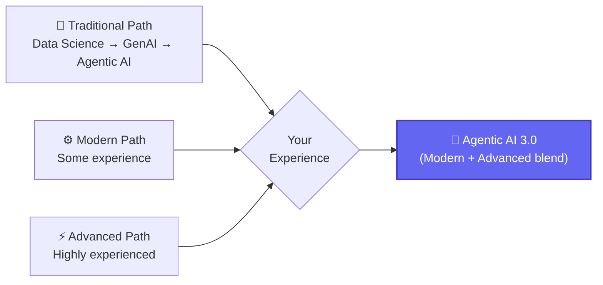
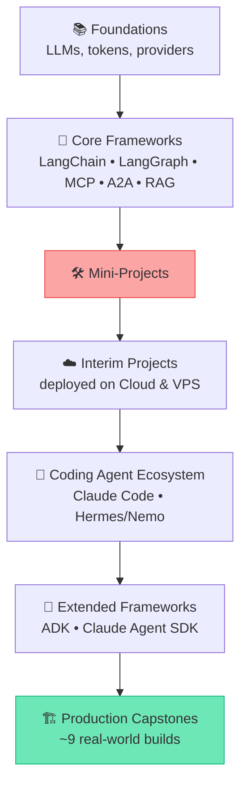

# 🚀 Class 00 — Course Induction & Roadmap
### Agentic AI 3.0 Specialization with AgentOps | Live Class 2026

**🎙️ Speakers:** Krish Naik (Founder) & Mayank Aggarwal (Lead Mentor)
**📅 Date:** 21 June 2026 · **⏱️ Duration:** ~4.5 hours · **🎯 Type:** Batch Induction + Live Q&A

> 📁 No code ships with this session — it's the map before the road trip. Every folder linked from here on is a stop on this roadmap.

---

## 🧭 Where This Course Sits

## 🗺️ The Full Curriculum Arc

This repository tracks the journey from **S1 → S2** onward — every class folder below is a checkpoint on this exact arc.

## 📅 Cadence

- 🗓️ **Every Saturday & Sunday, 8–11 AM IST**, for 5–6 months
- 📼 Recordings uploaded within 24 hours; course access valid 2 years
- 📖 Detailed running notes, links, and Colab notebooks: **[Mayank's Craft notes](https://bugs-sleep-6uj.craft.me/agentic3)**

## 📊 Mayank's Golden Rules (repeated all course long)

> *"Simple is scalable. That's something I've time-tested."*

1. 💰 **Cost** — including token usage
2. ⚠️ **Failure Rate** — trending toward zero
3. ⚡ **Latency**
4. ✨ **Quality** — is the output actually useful?

## ✅ Before Class 01

- [ ] 🐍 Go through a Python refresher if coding is new to you
- [ ] 🔗 Bookmark the [Craft notes doc](https://bugs-sleep-6uj.craft.me/agentic3) — used for the entire course
- [ ] 🗓️ Block Saturday & Sunday, 8–11 AM IST
- [ ] 📖 Skim the [repo root README](../README.md) for the full class index

---

## ➡️ Up Next

**[Class 01 — 27 Jun — Python Setup & API Basics »](<01 - 27 Jun - Python Setup & API Basics.md>)**
📂 Code folder: *(none this session — environment setup begins Class 01)*

---
*Part of the [Live-Class-2026](../README.md) class summary index · ⬆️ [Weekend 00 overview](<../Weekend 00 - 20-21 Jun/README.md>).*
