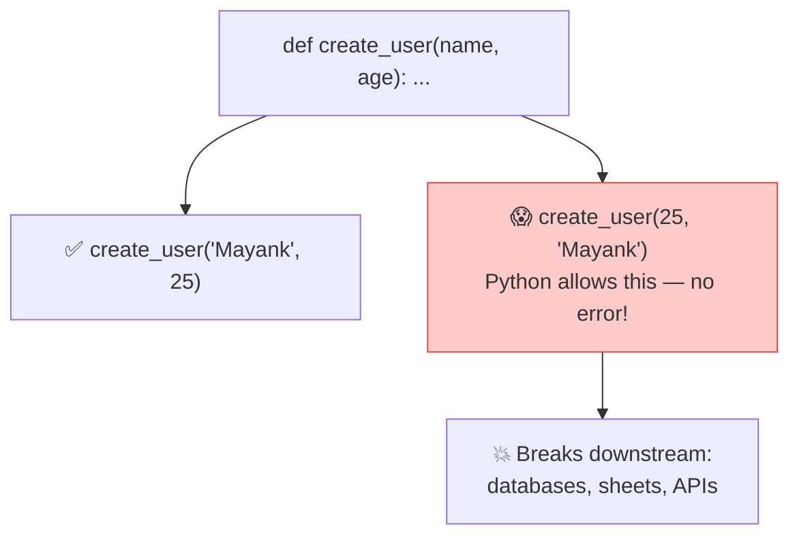

# 🧱 Class 02 — Python Refresher: OOP, Decorators & the Case for Pydantic
### Agentic AI 3.0 Specialization | Live Class 2026

**🎙️ Mentor:** Mayank Aggarwal · **📅 Date:** 28 June 2026 · **⏱️ Duration:** ~4.5 hours

> 📂 **Code for this class:** [`02-03 - 28 Jun & 4 Jul - Python Refresher & Pydantic Deep Dive/`](<../Weekend 01 - 27-28 Jun/02-03 - 28 Jun & 4 Jul - Python Refresher & Pydantic Deep Dive/>) — files `_0` through `_4`, an expanded 15-file codebase that carries this same numbering all the way through Class 05's agent-with-memory

---

## 🏛️ Object-Oriented Python — The Bank Account Example

The real file, [`_2_oop_classes.py`](<../Weekend 01 - 27-28 Jun/02-03 - 28 Jun & 4 Jul - Python Refresher & Pydantic Deep Dive/_2_oop_classes.py>), opens with a comment that sets up the entire class's arc: *"Class 1 only ever showed you a class wearing an 'Agent' costume; this file is the bare pattern, on its own, so it actually generalizes."*

```python
class BankAccount:
    """A blueprint for a bank account -- nothing to do with AI."""

    def __init__(self, owner: str, balance: float = 0.0):
        self.owner = owner       # every instance gets its OWN owner
        self.balance = balance   # and its OWN balance -- this is the account's STATE
        self.history = []

    def deposit(self, amount: float) -> None:
        self.balance += amount
        self.history.append(f"Deposited {amount}")

    def withdraw(self, amount: float) -> None:
        if amount > self.balance:
            print(f"Insufficient funds: tried to withdraw {amount}, balance is {self.balance}")
            return
        self.balance -= amount
        self.history.append(f"Withdrew {amount}")

account_1 = BankAccount(owner="Mayank", balance=1000)
account_2 = BankAccount(owner="Krish", balance=500)
account_1.deposit(200)
account_2.withdraw(1000)   # deliberately too much -- shows the guard clause working
```

The `if amount > self.balance` guard is a small, deliberate preview of the safety checks agents will need later — reject the bad request instead of letting it silently corrupt state.

## 📦 DataClasses — Killing the Boilerplate

The same file continues straight into `@dataclass`, framed as "the same blueprint concept, written the shorter way":

```python
from dataclasses import dataclass, field

@dataclass
class Book:
    title: str
    author: str
    pages_read: int = 0
    tags: list = field(default_factory=list)   # mutable defaults need field(default_factory=...)

    def read(self, pages: int) -> None:
        self.pages_read += pages

my_book = Book(title="Atomic Habits", author="James Clear")
my_book.read(40)
```

`@dataclass` auto-generates `__init__` from type-hinted attributes — but it **does not validate anything at runtime**. That gap is exactly what next class's Pydantic deep-dive closes. The file's closing line even flags this forward: *"Hold onto this exact pattern: file 11 today reuses it, unchanged, to define an Agent."*

## 🎁 Decorators — Wrapping Without Changing

[`_4_decorators.py`](<../Weekend 01 - 27-28 Jun/02-03 - 28 Jun & 4 Jul - Python Refresher & Pydantic Deep Dive/_4_decorators.py>) builds two decorators, then stacks them:

```python
import functools, time

def announce(func):
    """Announces when a function starts and finishes."""
    @functools.wraps(func)   # preserves func.__name__ for introspection
    def wrapper(*args, **kwargs):
        print(f"Starting {func.__name__}...")
        result = func(*args, **kwargs)
        print(f"Finished {func.__name__}.")
        return result
    return wrapper

def timed(func):
    """Prints how long a function took to run."""
    @functools.wraps(func)
    def wrapper(*args, **kwargs):
        start = time.perf_counter()
        result = func(*args, **kwargs)
        elapsed_ms = (time.perf_counter() - start) * 1000
        print(f"{func.__name__} took {elapsed_ms:.2f} ms")
        return result
    return wrapper

@announce
@timed
def slow_greeting(name):
    time.sleep(0.02)
    return f"Hello there, {name}!"
```

🔗 **Why this matters later:** agent tool definitions (`@tool`) use exactly this pattern — a function wrapped so something can call it with extra behavior attached. File 10 later in this same folder reuses this exact wrapper, unchanged, to register a real tool.

## ⚠️ The Problem Pydantic Will Solve

Python is dynamically typed — nothing stops the wrong type from silently flowing through a function, all the way into a database or an LLM call. Manual `isinstance()` checks don't scale past a handful of functions. That exact pain is the hook into Class 03.



## 📁 What's in the Code Folder

| File | Covers |
|---|---|
| [`_0_basics_refresher.py`](<../Weekend 01 - 27-28 Jun/02-03 - 28 Jun & 4 Jul - Python Refresher & Pydantic Deep Dive/_0_basics_refresher.py>) | Quick Class 01 recap — variables, f-strings, `if`/`elif`/`else` |
| [`_1_data_structures.py`](<../Weekend 01 - 27-28 Jun/02-03 - 28 Jun & 4 Jul - Python Refresher & Pydantic Deep Dive/_1_data_structures.py>) | Lists, tuple unpacking, dicts, and the pattern that matters most later: a **list of dicts** |
| [`_2_oop_classes.py`](<../Weekend 01 - 27-28 Jun/02-03 - 28 Jun & 4 Jul - Python Refresher & Pydantic Deep Dive/_2_oop_classes.py>) | `BankAccount`, `Book` — plain classes, then the `@dataclass` shortcut |
| [`_3_error_handling.py`](<../Weekend 01 - 27-28 Jun/02-03 - 28 Jun & 4 Jul - Python Refresher & Pydantic Deep Dive/_3_error_handling.py>) | `try`/`except`/`finally`, multiple exception types, tied back to a missing dict key |
| [`_4_decorators.py`](<../Weekend 01 - 27-28 Jun/02-03 - 28 Jun & 4 Jul - Python Refresher & Pydantic Deep Dive/_4_decorators.py>) | The wrapper pattern, generic, then stacked (`@announce` `@timed`) |

## ✅ Action Items

- [ ] 🏦 Rebuild `BankAccount` from scratch, don't copy-paste
- [ ] 📦 Write a `@dataclass` and trigger the mutable-default-list bug on purpose
- [ ] 🎁 Write a custom decorator with `functools.wraps`, then stack two on one function
- [ ] 📖 Read up on `*args` / `**kwargs` before next class

---

## ➡️ Up Next
**[Class 03 — 4 Jul — Pydantic Deep Dive »](<03 - 4 Jul - Pydantic Deep Dive.md>)**

---
*Part of the [Live-Class-2026](../README.md) class summary index · ⬆️ [Weekend 01 overview](<../Weekend 01 - 27-28 Jun/README.md>). ⬅️ [Class 01](<01 - 27 Jun - Python Setup & API Basics.md>)*
