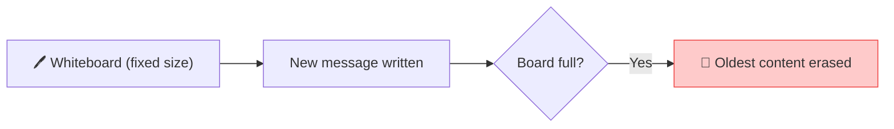

# 🛡️ Class 03 — Pydantic Deep Dive + AI Foundations
### Agentic AI 3.0 Specialization | Live Class 2026

**🎙️ Mentor:** Mayank Aggarwal · **📅 Date:** 4 July 2026 · **⏱️ Duration:** ~4.5 hours

> 📂 **Code for this class:** [`02-03 - 28 Jun & 4 Jul - Python Refresher & Pydantic Deep Dive/`](<../Weekend 01 - 27-28 Jun/02-03 - 28 Jun & 4 Jul - Python Refresher & Pydantic Deep Dive/>) — files `_5`–`_10` and the standalone [`8_Pydantic/`](<../Weekend 01 - 27-28 Jun/02-03 - 28 Jun & 4 Jul - Python Refresher & Pydantic Deep Dive/8_Pydantic/>) mini-project

---

## 😩 The Problem, Stated in Code First

[`_8_pydantic_with_ai.py`](<../Weekend 01 - 27-28 Jun/02-03 - 28 Jun & 4 Jul - Python Refresher & Pydantic Deep Dive/_8_pydantic_with_ai.py>) opens not with a definition, but with the actual failure mode Pydantic exists to catch — a realistic messy LLM reply:

```python
print("=== The problem ===")
print("Imagine an LLM replied with:", {"amount": "five hundred", "currency": "us dollars"})
print("'five hundred' isn't a number Python can do math with. 'us dollars' isn't a currency CODE.")
```

## 🧱 `BaseModel`: the Shape You're Willing to Trust

```python
from pydantic import BaseModel, Field, field_validator, ValidationError

class CurrencyAmount(BaseModel):
    amount: float
    currency: str

good = CurrencyAmount(amount=100, currency="USD")             # ✅ fine

try:
    CurrencyAmount(amount="five hundred", currency="USD")     # ❌ ValidationError, instantly
except ValidationError as exc:
    print(exc)

coerced = CurrencyAmount(amount="100", currency="USD")        # "100" (str) -> 100.0 (float), automatically
```

## 📏 `Field()` — Constraints Beyond "the Right Type"

```python
class BoundedAmount(BaseModel):
    amount: float = Field(gt=0, description="Must be positive")
    currency: str = Field(min_length=3, max_length=3)

try:
    BoundedAmount(amount=-50, currency="USD")   # type is fine, VALUE isn't -- rejected anyway
except ValidationError as exc:
    print(exc)
```

## 🧭 `@field_validator` — Custom Rules, the Same Decorator Pattern From Class 02

```python
KNOWN_CURRENCIES = {"USD", "INR", "EUR", "GBP", "JPY"}

class StrictAmount(BaseModel):
    amount: float = Field(gt=0)
    currency: str

    @field_validator("currency")
    @classmethod
    def must_be_known(cls, value: str) -> str:
        value = value.upper().strip()
        if value not in KNOWN_CURRENCIES:
            raise ValueError(f"{value!r} isn't a recognized currency: {KNOWN_CURRENCIES}")
        return value

normalized = StrictAmount(amount=100, currency="usd")   # 'usd' -> 'USD', normalized automatically
```

## 🪆 Nested Models

```python
class ConversionRequest(BaseModel):
    source: StrictAmount
    target_currency: str

request = ConversionRequest(source={"amount": 250, "currency": "eur"}, target_currency="GBP")
print(f"{request.source.amount} {request.source.currency} -> {request.target_currency}")
```

## 🎯 The Use Case That Actually Matters: Validating an LLM's Raw Text

```python
llm_clean_output = '{"amount": 300, "currency": "usd"}'
print(StrictAmount.model_validate_json(llm_clean_output))   # works cleanly

llm_messy_output = '{"amount": "a few hundred", "currency": "dollars"}'
try:
    StrictAmount.model_validate_json(llm_messy_output)
except ValidationError as exc:
    print(f"Caught before it could break anything downstream:\n{exc}")
```

This one function, `model_validate_json`, is the entire bridge between "an LLM said something" and "my code can trust it" — nothing more exotic than that.

## 🧠 AI Vocabulary — Five Terms Before Building an Agent

| Term | One-line mental model |
|---|---|
| **LLM** | Predicts the next *token*, not the next word — pattern completion, not understanding |
| **Tokens** | The billing currency — ~¾ of a word each; output tokens cost more than input |
| **Vector Embeddings** | Words become coordinates; similar meaning → close together in that space |
| **Context Window** | A whiteboard of fixed size — oldest content quietly erased once it's full |
| **Parameters** | Billions of fixed weights set at training time — not the same thing as tokens |



## 📁 What's in the Code Folder

| File | Covers |
|---|---|
| [`_5_calling_a_real_api.py`](<../Weekend 01 - 27-28 Jun/02-03 - 28 Jun & 4 Jul - Python Refresher & Pydantic Deep Dive/_5_calling_a_real_api.py>) | The Frankfurter currency API, wrapped in a reusable function with `_3`'s error handling |
| [`_6_fake_ai_call.py`](<../Weekend 01 - 27-28 Jun/02-03 - 28 Jun & 4 Jul - Python Refresher & Pydantic Deep Dive/_6_fake_ai_call.py>) | A zero-dependency stand-in shaped exactly like a real OpenAI-style client — `.chat.completions.create(...).choices[0].message.content` |
| [`_7_ai_call_free_and_paid.py`](<../Weekend 01 - 27-28 Jun/02-03 - 28 Jun & 4 Jul - Python Refresher & Pydantic Deep Dive/_7_ai_call_free_and_paid.py>) | Real calls across Groq, OpenRouter (`model="openrouter/free"`, auto-routes so it never goes stale), and OpenAI |
| [`_8_pydantic_with_ai.py`](<../Weekend 01 - 27-28 Jun/02-03 - 28 Jun & 4 Jul - Python Refresher & Pydantic Deep Dive/_8_pydantic_with_ai.py>) | Everything above — the full Pydantic walkthrough |
| [`_9_api_call_with_structure.py`](<../Weekend 01 - 27-28 Jun/02-03 - 28 Jun & 4 Jul - Python Refresher & Pydantic Deep Dive/_9_api_call_with_structure.py>) | File `_5`'s API, now Pydantic-validated |
| [`_10_tool_with_ai_call.py`](<../Weekend 01 - 27-28 Jun/02-03 - 28 Jun & 4 Jul - Python Refresher & Pydantic Deep Dive/_10_tool_with_ai_call.py>) | The `@tool` decorator applied for real: a validated `convert_currency` tool sitting *next to* — but not yet wired into — a real AI call |
| [`8_Pydantic/`](<../Weekend 01 - 27-28 Jun/02-03 - 28 Jun & 4 Jul - Python Refresher & Pydantic Deep Dive/8_Pydantic/>) | Standalone from-scratch Pydantic mini-project (`BaseModel`, `EmailStr`, typed lists/dicts) |

## ✅ Action Items

- [ ] 🛡️ Define a `BaseModel` with `Field()` constraints from memory
- [ ] 🧩 Write a `field_validator` — know *why* it exists, not just its syntax
- [ ] 🪆 Nest one Pydantic model inside another
- [ ] 🔌 Run `_10_tool_with_ai_call.py` and notice: the tool and the AI call both work, but **neither knows the other exists yet** — that wiring is Class 04
- [ ] 📖 Know **LLM, Token, Vector Embedding, Context Window, Parameters** cold

---

## ➡️ Up Next
**[Class 04 — 5 Jul — Anatomy of an Agent »](<04 - 5 Jul - Anatomy of an Agent.md>)**
📂 Code folder: [`04-05 - 5 Jul & 11 Jul - Anatomy of an Agent & The Agentic Loop/`](<../Weekend 02 - 4-5 Jul/04-05 - 5 Jul & 11 Jul - Anatomy of an Agent & The Agentic Loop/>)

---
*Part of the [Live-Class-2026](../README.md) class summary index · ⬆️ [Weekend 02 overview](<../Weekend 02 - 4-5 Jul/README.md>). ⬅️ [Class 02](<02 - 28 Jun - Python Refresher.md>)*
