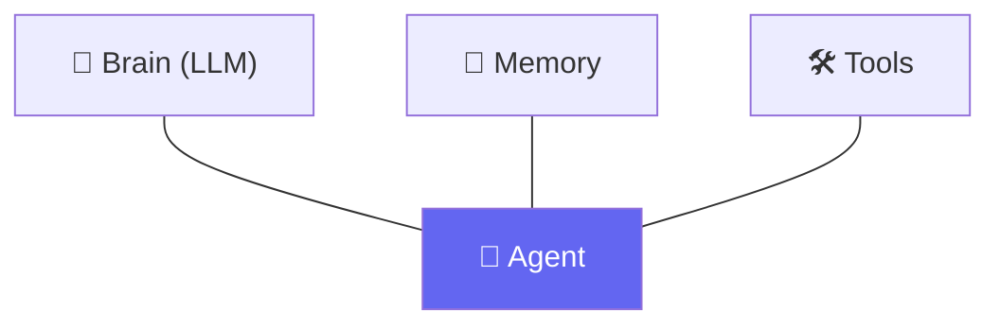

# 🤖 Class 04 — LLMs Are Stateless & The Anatomy of an Agent
### Agentic AI 3.0 Specialization | Live Class 2026

**🎙️ Mentor:** Mayank Aggarwal · **📅 Date:** 5 July 2026 · **⏱️ Duration:** ~4.5 hours

> 📂 **Code for this class:** [`04-05 - 5 Jul & 11 Jul - Anatomy of an Agent & The Agentic Loop/Project 0/`](<../Weekend 02 - 4-5 Jul/04-05 - 5 Jul & 11 Jul - Anatomy of an Agent & The Agentic Loop/Project 0/>) — files `_01`–`_04`, the start of **Project Zero**

---

## 🧠 The Big Idea: LLM Calls Are Stateless

Every AI call — ChatGPT, Claude, an API request — gives an input and gets an output. It remembers nothing on its own. What *looks* like memory in a chat UI is really: **the entire history gets resent, every single message.**

## 🪜 Model → Chatbot → Agent, in Actual Code

[`_01_ai_model_vs_chatbot_vs_agent.py`](<../Weekend 02 - 4-5 Jul/04-05 - 5 Jul & 11 Jul - Anatomy of an Agent & The Agentic Loop/Project 0/_01_ai_model_vs_chatbot_vs_agent.py>) draws all three as real Python — deliberately with **no API calls yet**, so the structural difference is visible without any network noise:

```python
def ai_model(question: str) -> str:
    """A single one-shot prediction. Remembers NOTHING between calls."""
    return f"[Mock prediction for]: {question}"

class Chatbot:
    """Wraps ai_model() with conversation history."""
    def __init__(self) -> None:
        self.history: list[dict] = []

    def ask(self, question: str) -> str:
        self.history.append({"role": "user", "content": question})
        answer = ai_model(question)
        self.history.append({"role": "assistant", "content": answer})
        return answer

class Agent:
    """Wraps ai_model() with history AND a set of tools it can choose to use."""
    def __init__(self, tools: dict[str, callable]) -> None:
        self.history: list[dict] = []
        self.tools = tools

    def decide_tool(self, question: str) -> str | None:
        for name in self.tools:
            if name in question.lower():   # a KEYWORD match -- deliberately naive for now
                return name
        return None

    def ask(self, question: str) -> str:
        self.history.append({"role": "user", "content": question})
        tool_name = self.decide_tool(question)
        if tool_name is not None:
            result = self.tools[tool_name]()
            answer = f"[used tool: {tool_name}] {result}"
        else:
            answer = ai_model(question)
        self.history.append({"role": "assistant", "content": answer})
        return answer
```

The file is explicit that `decide_tool`'s keyword match is a placeholder: *"NOT how real decision-making works — File 5 replaces this with a real model actually making that choice based on meaning, not string matching."*

## 🏗️ Anatomy of an Agent — Brain, Memory, Tools



## 🔌 Calling a Real Model — Four Providers, One Shape

[`_02_calling_the_ai_paid_and_free.py`](<../Weekend 02 - 4-5 Jul/04-05 - 5 Jul & 11 Jul - Anatomy of an Agent & The Agentic Loop/Project 0/_02_calling_the_ai_paid_and_free.py>) puts all four providers side by side, so the differences (and the one real exception) are visible in one file:

```python
def ask_openai(question: str) -> str:
    """Paid. Standard shape: a list of messages in, one string answer out."""
    from openai import OpenAI
    client = OpenAI(api_key=os.environ["OPENAI_API_KEY"])
    response = client.chat.completions.create(model="gpt-4o-mini", max_tokens=200,
                                                messages=[{"role": "user", "content": question}])
    return response.choices[0].message.content

def ask_anthropic(question: str) -> str:
    """Paid. Anthropic's SDK is the ONE exception among these four: .messages.create()
    instead of .chat.completions.create(), and .content[0].text instead of
    .choices[0].message.content."""
    from anthropic import Anthropic
    client = Anthropic(api_key=os.environ["ANTHROPIC_API_KEY"])
    response = client.messages.create(model="claude-3-5-haiku-20241022", max_tokens=200,
                                        messages=[{"role": "user", "content": question}])
    return response.content[0].text

def ask_groq(question: str) -> str:
    """Free. Uses the OpenAI SDK, pointed at Groq's own base_url -- otherwise identical."""
    from openai import OpenAI
    client = OpenAI(api_key=os.environ["GROQ_API_KEY"], base_url="https://api.groq.com/openai/v1")
    response = client.chat.completions.create(model="llama-3.3-70b-versatile", max_tokens=200,
                                                messages=[{"role": "user", "content": question}])
    return response.choices[0].message.content
```

`ask_ai()` then picks whichever key is actually set in `.env`, free providers first — the same provider-picker pattern reused in every file for the rest of the course.

## 📐 Structuring the Reply With Pydantic

[`_03_structuring_with_pydantic.py`](<../Weekend 02 - 4-5 Jul/04-05 - 5 Jul & 11 Jul - Anatomy of an Agent & The Agentic Loop/Project 0/_03_structuring_with_pydantic.py>) asks the model to reply with **only** a JSON object, then validates it before trusting a single field:

```python
class WeatherQuestion(BaseModel):
    city: str
    wants_fahrenheit: bool = False

def extract_weather_question(user_message: str) -> WeatherQuestion | str:
    instruction = (
        "Read the user's message and reply with ONLY a JSON object -- no other text -- "
        'in this exact shape: {"city": "<city name>", "wants_fahrenheit": <true or false>}. '
        f"User's message: {user_message!r}"
    )
    raw_reply = ask_ai(instruction)
    try:
        cleaned = raw_reply.strip().removeprefix("```json").removesuffix("```").strip()
        data = json.loads(cleaned)
        return WeatherQuestion(**data)
    except (json.JSONDecodeError, ValidationError) as exc:
        return f"Rejected: {exc}"
```

## 🛠️ Giving It a Tool — Manually

[`_04_giving_it_a_tool.py`](<../Weekend 02 - 4-5 Jul/04-05 - 5 Jul & 11 Jul - Anatomy of an Agent & The Agentic Loop/Project 0/_04_giving_it_a_tool.py>) chains the extraction above straight into a real tool call — but **we** decide to call it, not the model:

```python
def answer_weather_question(user_message: str) -> str:
    """The full manual pipeline: extract a trusted city with Pydantic, then
    WE decide to call get_weather and WE pass the extracted field in.
    Nothing here is decided by the model beyond the extraction step."""
    extracted = extract_weather_question(user_message)
    if not isinstance(extracted, WeatherQuestion):
        return f"Could not extract a city: {extracted}"
    return get_weather(extracted.city)
```

That's the exact gap Class 05 closes: letting the *model itself* decide when to reach for the tool.

## ✅ Action Items

- [ ] 🧠 Explain "LLM calls are stateless" in your own words
- [ ] 🔌 Run `_02` and compare Anthropic's response shape against the other three providers directly
- [ ] 📐 Trace through `_03` and explain why the JSON is stripped of ` ```json ` fences before parsing
- [ ] 🛠️ Run `_04` end to end, then identify exactly which line represents "we decided," not "the model decided"

---

## ➡️ Up Next
**[Class 05 — 11 Jul — The Agentic Loop (Pure Python) »](<05 - 11 Jul - The Agentic Loop.md>)**

---
*Part of the [Live-Class-2026](../README.md) class summary index · ⬆️ [Weekend 02 overview](<../Weekend 02 - 4-5 Jul/README.md>). ⬅️ [Class 03](<03 - 4 Jul - Pydantic Deep Dive.md>)*
