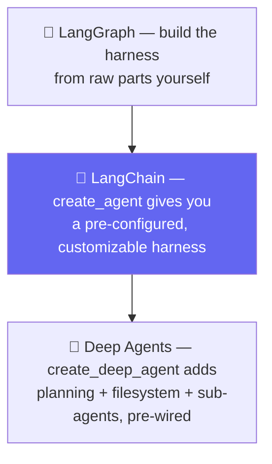

# 🚗 Class 07 — The LangChain Family, Harness Engineering & First Models
### Agentic AI 3.0 Specialization | Live Class 2026

**🎙️ Mentor:** Mayank Aggarwal · **📅 Date:** 18 July 2026 · **⏱️ Duration:** ~4.5 hours

> 📂 **Code for this class:** [`07-08 - 18-19 Jul - LangChain Family & the Model Layer/Notebook For Reference/01_landscape_student_notes.ipynb`](<../Weekend 04 - 18-19 Jul/07-08 - 18-19 Jul - LangChain Family & the Model Layer/Notebook For Reference/01_landscape_student_notes.ipynb>)

---

## 🏠 Four Products, One Team, Four Different Jobs

The real student-notes notebook opens with the exact confusion this class exists to resolve — *"LangChain vs LangGraph vs LangSmith — Which One Should I Use?"* — and its answer: **none of these four are competitors. You don't "pick one." You use as many as your project actually needs.**

- **LangGraph** — the low-level orchestration foundation: branching, loops, persistence, durable execution. Most people building agents never touch it directly at first, because LangChain hides that complexity until it's genuinely needed.
- **LangChain** — `create_agent`, a highly configurable harness, built *on top of* LangGraph. This is what the whole course is built around from here on.
- **Deep Agents** — built on top of `create_agent`; comes with planning tools, a virtual filesystem, and sub-agent spawning pre-wired.
- **LangSmith** — fundamentally different from the other three: not something you build with, but an **observability and evaluation platform**.

## 🔭 Why LangSmith Exists — the Real Argument

> With a normal Python script, if something goes wrong, you read the stack trace and the code, and you can usually figure out exactly what happened. An **agent** is different — it decides what to do at *runtime*. You cannot "read the code" to know what an agent actually did on a specific run, because the code only describes what it *could* do, not what it *did*.

LangSmith records a **trace** — a complete, timestamped record of every model call, tool call, and decision. Two environment variables turn it on:
```
LANGSMITH_TRACING=true
LANGSMITH_API_KEY=your-key-here
```
The free Developer tier includes 5,000 traces/month as of 2026 — more than enough for learning.

## 🎯 The Single Most Important Sentence in This Course

> **An agent is a model calling tools in a loop until a given task is complete.**
> **A harness is everything around that loop.**

The **model** is raw reasoning power with zero ability to *do* anything — it doesn't know what tools exist, has no behavioral instructions, can't check anything outside its own knowledge. The **harness** — system prompt, tools, middleware — is what turns that raw capability into something useful. `create_agent(model=..., tools=..., system_prompt=...)` configures the harness *around* a model; it never builds a new model.



## 📜 A Real Timeline, Not "It's Changed a Lot"

| Date | What happened |
|---|---|
| **Oct 2022** | LangChain launches. LLM abstractions + "Chains" — predetermined computation sequences |
| **Dec 2022** | First general-purpose agents, based on the ReAct paper — the model generates JSON, LangChain hand-parses it into a tool call |
| **Feb 2024** | LangGraph released — streaming, durable execution, short-term memory, human-in-the-loop |
| **Oct 2024** | LangGraph becomes the preferred way to build past a single call; most old chains/agents deprecated |
| **Oct 20, 2025** | **LangChain v1.0** — one unified agent abstraction. Old code needs the separate `langchain-classic` package |
| **Mar 15, 2026** | Deep Agents released |

**A concrete, checkable signal for outdated content:** if a 2026-dated tutorial imports `AgentExecutor` directly from `langchain`, running it throws an `ImportError` — not a bug in your setup, but because that functionality now deliberately lives in `langchain-classic`, kept apart so the main v1.0 package stays clean.

## 💬 Real FAQs From This Exact Class

Pulled directly from the course's own FAQ notes for this session:

> **"If LangChain is 'built on top of' LangGraph, why don't we just learn LangGraph directly and skip a layer?"**
> Because `create_agent` is specifically designed to hide LangGraph's complexity until you actually need it. It's the same reason you don't learn assembly language before Python — the abstraction exists on purpose, and dropping to the lower layer only pays off once you hit something the higher layer genuinely can't do.

> **"Is LangSmith the same as LangChain's own built-in logging or print statements?"**
> Not remotely — print statements show you what you thought to check. A LangSmith trace shows you the FULL sequence of every model call, tool call, and middleware decision, whether you thought to check it or not, plus latency and token cost per step. It's the difference between a diary and a flight recorder.

> **"This all sounds like a lot of infrastructure just to ask an LLM a question. Is it overkill for something simple?"**
> For a single one-off question, yes — genuinely, just call the model directly, you don't need any of this. All of this earns its cost the moment you need reliability: multiple tool calls, memory across a conversation, or anything you'll want to debug later when it inevitably gets something wrong.

## ✅ Self-Check (from the real notebook)

1. If someone asks you to *build* an agent quickly with a lot of customization, which tool do you reach for?
2. If your agent misbehaves in production and you need to know exactly what happened on one run, which tool do you reach for?
3. Fill in the blank: *"An agent is a model calling ___ in a ___ until a given task is complete."*
4. Why would a tutorial using `AgentExecutor` be a signal the content might be outdated?

*(Answers: 1 — `create_agent`, or Deep Agents for batteries-included. 2 — LangSmith. 3 — "tools", "loop". 4 — `AgentExecutor` predates v1.0's October 2025 unification into `create_agent`.)*

## ✅ Action Items After Class 07

- [ ] 🏗️ Set up a fresh `uv`-based LangChain project locally (`.env`, `.gitignore`, `.env.example`)
- [ ] 🔭 Turn on `LANGSMITH_TRACING=true` and look at one real trace end to end
- [ ] 📜 Memorize the timeline well enough to spot an outdated tutorial on sight
- [ ] 📖 Answer all four self-check questions without looking back

---

## ➡️ Up Next
**[Class 08 — 19 Jul — Inside the Model: Parameters, Streaming, Tools & Structured Output »](<08 - 19 Jul - Inside the Model.md>)**

---
*Part of the [Live-Class-2026](../README.md) class summary index · ⬆️ [Weekend 04 overview](<../Weekend 04 - 18-19 Jul/README.md>). ⬅️ [Class 06](<06 - 12 Jul - Introduction to LangChain.md>)*
