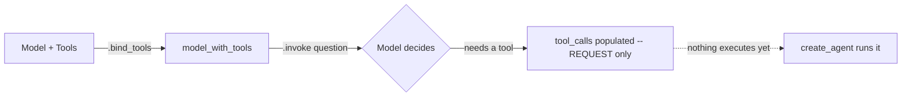
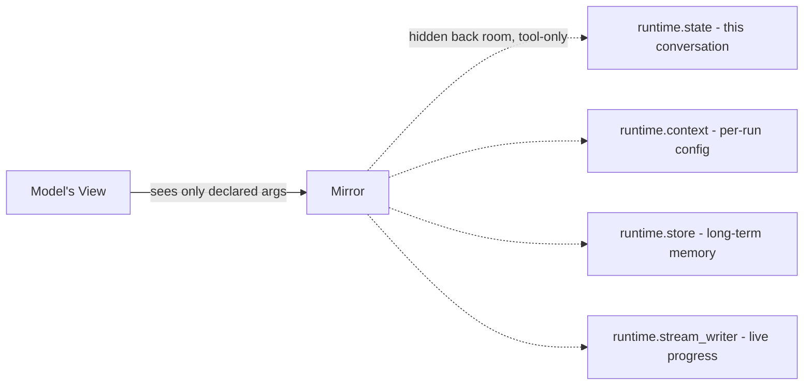
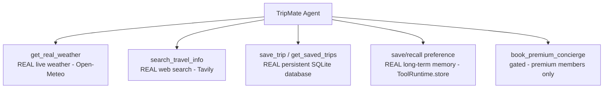

# 🛠️ Class 10 — Tools Deep Dive: Giving CineBot Hands
### Agentic AI 3.0 Specialization | Live Class 2026

**🎙️ Mentor:** Mayank Aggarwal · **📅 Date:** 26 July 2026 · **⏱️ Duration:** ~5 hours

> 📂 **Code for this class:** [`09-10 - 25-26 Jul - Structured Output & Tools (CineBot)/Assignment & Questions/Student_Reference_Structured_Output_and_Tools.ipynb`](<../Weekend 05 - 25-26 Jul/09-10 - 25-26 Jul - Structured Output & Tools (CineBot)/Assignment & Questions/Student_Reference_Structured_Output_and_Tools.ipynb>) (Chapter 2) · [`Langchain-Tools.ipynb`](<../Weekend 05 - 25-26 Jul/09-10 - 25-26 Jul - Structured Output & Tools (CineBot)/Langchain-Tools.ipynb>)

---

## ✋ A Brain Without Hands

Asked directly — *"Is Interstellar showing at 7pm tonight at the Downtown cinema?"* — with no tool available, CineBot either admits it has no idea, or worse, says something confident-sounding it completely made up. Neither is acceptable for a real booking system. A model, however smart, cannot act in the world. That gap is exactly what tools close.

## 🛠️ Writing a Real Tool — Name, Description, `.args`

```python
from langchain_core.tools import tool

@tool
def check_showtimes(movie_title: str) -> str:
    """Check available showtimes for a movie at the cinema.

    Args:
        movie_title: The exact title of the movie to check
    """
    fake_showtimes = {
        "interstellar": "7:00 PM and 10:15 PM",
        "dune part two": "9:30 PM only",
        "oppenheimer": "Sold out for tonight",
    }
    return fake_showtimes.get(movie_title.lower(), "No showtimes found for that title.")

print(check_showtimes.name)          # 'check_showtimes'
print(check_showtimes.description)   # the docstring, verbatim -- this is what the model reads
print(check_showtimes.args)          # the inferred schema
```

The docstring's `Args:` section isn't decoration — it sharpens exactly what the model understands about each parameter, and it's worth writing properly even for a "throwaway" tool.

## 🎨 Overriding Name & Description

```python
@tool("book_seats", description="Book cinema seats for a customer. Use this whenever a customer wants to reserve tickets.")
def reserve(movie: str, seats: int) -> str:
    """Reserve seats."""  # this docstring is now IGNORED -- description= above wins
    return f"Reserved {seats} seat(s) for {movie}"
```

Useful when you're wrapping an existing function that was named and documented for a different purpose entirely.

## 📐 `args_schema` — Rich Constraints Beyond Plain Type Hints

```python
class SeatBookingInput(BaseModel):
    """Input for booking cinema seats."""
    movie_title: str = Field(description="Exact movie title")
    seat_count: int = Field(description="Number of seats to book", ge=1, le=10)
    preferred_row: Literal["front", "middle", "back"] = Field(default="middle")

@tool(args_schema=SeatBookingInput)
def book_seats(movie_title: str, seat_count: int, preferred_row: str = "middle") -> str:
    """Book seats for a movie."""
    return f"Booked {seat_count} seat(s) in the {preferred_row} row for {movie_title}."
```

## 🚫 The Reserved-Name Trap, Reproduced Live

```python
try:
    @tool
    def broken_tool(movie_title: str, config: str) -> str:
        """A tool that accidentally uses a reserved argument name."""
        return f"{movie_title}, {config}"
    broken_tool.invoke({"movie_title": "Dune", "config": "test"})
except Exception as e:
    print(f"Failed -- 'config' is reserved: {type(e).__name__}: {e}")

# Fix: just pick any other name.
@tool
def fixed_tool(movie_title: str, settings: str) -> str:
    """A tool using a safe, non-reserved argument name."""
    return f"{movie_title}, {settings}"
```

`config` and `runtime` are reserved — the tool *defines* fine, but fails the moment an agent actually calls it.

## 🔗 Binding ≠ Running

```python
model_with_tools = model.bind_tools([check_showtimes, book_seats])
response = model_with_tools.invoke("Is Interstellar show available tonight?")
for tool_call in response.tool_calls:
    print("-->", tool_call["name"], tool_call["args"])   # a REQUEST -- nothing has executed
```



Actually running the tool and looping back for a final answer is `create_agent`'s job.

## 🪞 `ToolRuntime` — the Mirror Analogy, in Real Code



```python
from langchain.tools import tool, ToolRuntime
from langchain_core.messages import HumanMessage

@tool
def get_last_movie_mentioned(runtime: ToolRuntime) -> str:
    """Find the last movie title the customer mentioned in this conversation."""
    for message in reversed(runtime.state["messages"]):
        if isinstance(message, HumanMessage):
            return f"Last thing the customer said: {message.content}"
    return "No customer messages found."

print(get_last_movie_mentioned.args)   # 'runtime' genuinely does NOT appear here
```

`runtime` is invisible to the model because LangChain automatically excludes any parameter annotated `ToolRuntime` from the schema it sends.

## 🎬 Memory That Survives Across Entirely Separate Visits

```python
from langgraph.store.memory import InMemoryStore
loyalty_store = InMemoryStore()

@tool
def save_favourite_genre(customer_id: str, genre: str, runtime: ToolRuntime) -> str:
    """Save a customer's favorite movie genre for future visits."""
    runtime.store.put((customer_id, "preferences"), "favorite_genre", {"value": genre})
    return f"Got it -- I'll remember you like {genre} movies."

@tool
def recall_favorite_genre(customer_id: str, runtime: ToolRuntime) -> str:
    """Recall a customer's favorite movie genre, if we've saved it before."""
    result = runtime.store.get((customer_id, "preferences"), "favorite_genre")
    return result.value["value"] if result else "We don't have a saved preference yet."

memory_agent = create_agent(model="openai:gpt-5-mini",
                             tools=[save_favourite_genre, recall_favorite_genre],
                             store=loyalty_store)
```

`runtime.state` only covers the current conversation; `runtime.store` is what makes memory survive across completely separate sessions. Beyond `.get()`/`.put()`, a `Store` also supports `.search()` to list every saved item for a given namespace.

## 🎯 `return_direct` — Skipping the Model's Rephrasing Pass

```python
@tool(return_direct=True)
def get_exact_refund_policy() -> str:
    """Tell the refund policy."""
    return "Tickets are refundable up to 2 hours before showtime. No refunds after that."
```

Use this when a model rewording the output could dangerously change its meaning — a refund policy's exact wording, not a paraphrase.

## 🚪 Gating a Tool Entirely, Not Just Instructing Around It

```python
@tool
def vip_lounge_booking(movie_title: str) -> str:
    """Book a VIP lounge seat with premium service. VIP members only."""
    return f"VIP lounge seat booked for {movie_title}."

@wrap_model_call
def gate_vip_tools(request: ModelRequest, handler) -> ModelResponse:
    """Only expose vip_lounge_booking to VIP members."""
    is_vip = request.state.get("is_vip_member", False)
    if not is_vip:
        allowed = [t for t in request.tools if t.name != "vip_lounge_booking"]
        request = request.override(tools=allowed)
    return handler(request)

# Same code, same query -- only the is_vip_member flag differs:
gated_agent.invoke({"messages": [("user", "Book me a VIP lounge seat for Dune?")]})                             # regular
gated_agent.invoke({"messages": [("user", "Book me a VIP lounge seat for Dune")], "is_vip_member": True})       # VIP
```

The model literally could not choose `vip_lounge_booking` in the regular case — it wasn't on its menu at all. A genuinely stronger guarantee than instructing the model not to use something.

## 🧳 What This All Builds Toward: TripMate



## ✅ Action Items

- [ ] 🛠️ Write a `@tool` with a full `Args:` docstring, print `.name`/`.description`/`.args`
- [ ] 🚫 Reproduce the `config` reserved-name failure, then fix it
- [ ] 🪞 Add `runtime: ToolRuntime` to a tool and confirm it's missing from `.args`
- [ ] 🎬 Reproduce `save_favourite_genre` / `recall_favorite_genre` with `InMemoryStore`
- [ ] 🚪 Reproduce the VIP gating example and confirm the regular-member call genuinely cannot select the gated tool

---

## ➡️ Up Next
**[Class 11 — 1 Aug — Agents, Middleware & Memory: Giving CineBot a Mind »](<11 - 01 Aug - Agents, Middleware & Memory.md>)**
📂 Code folder: [`11-12 - 1-8 Aug - Agents, Memory & Middleware/`](<../Weekend 06 - 1 Aug/11-12 - 1-8 Aug - Agents, Memory & Middleware/>)

---
*Part of the [Live-Class-2026](../README.md) class summary index · ⬆️ [Weekend 05 overview](<../Weekend 05 - 25-26 Jul/README.md>). ⬅️ [Class 09](<09 - 25 Jul - Structured Output Mastery.md>)*
